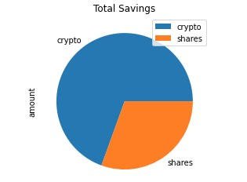
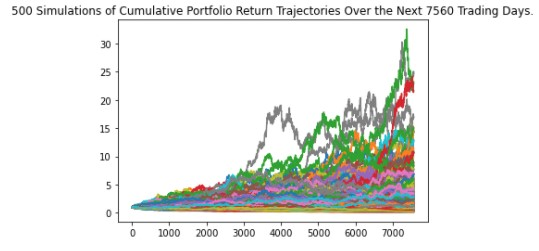
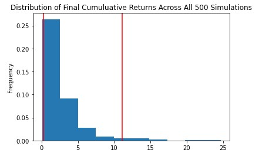

<!--- the header is made with: https://github.com/kyechan99/capsule-render -->

[Illya Nayshevsky, Ph.D.](illya.n@me.com) [](https://www.linkedin.com/in/illyanayshevskyy/)

<br>
Columbia FinTech Bootcamp Assignment

---
---

### Table of Contents

* [General Info](#general-info)
* [Installation](#installation)
* [Usage](#usage)
     - [Personal Finance Planner](#personal-finance-planner)
     - [Retirement Planning](#retirement-planning)


## General Info
Financial Planning tools contained in the <code>financial-planner.ipynb</code> were designed to assist individuals in:
1. Portfolio analysis - the script utilizes historical data feeds from Alternative Crypto API and Alpaca API get historical securities data, and calculate *emergency fund* viability and suggestions
2. Retirement Planning - the script utilizes Monte Carlo simulation analysis for retirement planning and projections.


## Installation
### General
Latest version of [Anaconda](https://www.anaconda.com/) and Python 3.7 are required to run the script.

Anaconda can be installed by downloading the latest version of the software from [Anaconda.com Downloads](https://www.anaconda.com/products/individual) and installing it locally.

### Libraries
The python native libraries required to run the script are:
1. Native python libraries: <code>os</code>, <code>time</code>, <code>datetime</code>
2. <code>[requests](https://pypi.org/project/requests/)</code> - REST database handling
3. <code>[pandas](https://pandas.pydata.org/)</code> - Financial computational library
4. <code>[dotenv](https://pypi.org/project/python-dotenv/)</code> - Handles environment variables and API key parser
5. <code>[alpaca](https://alpaca.markets/docs/api-documentation/)</code> - Internet broker API utilized for historical data feeds
6. <code>MCForecastTools</code> - Custom package for Monte Carlo simulations (no installation required)

All packages can be installed with [pip](https://pip.pypa.io/en/stable/):

```python
pip install requests, pandas, python-dotenv, alpaca-trade-api
```

### APIs
1. [Alternative Crypto API](https://alternative.me/crypto/api/) - free API with no API key required.
2. [Alpaca API](https://alpaca.markets/docs/) - free API, a key is required to make calls. A free (paper trading) account is sufficient to get public and private keys. The file path for the Alpaca API key <code>.env</code> file must be passed to <code>load_dotenv()</code>, which is located in cell 2.

---

## Usage
## Personal Finance Planner

Personal Financial Planner requires input of Cryptocurrency asset amounts: <code>my_btc</code> and <code>my_eth</code>; as well as individuals stock ETF and bond ETF asset amounts: <code>my_agg</code> and <code>my_spy</code>. Additional assets can be added to the analysis, but variables for thus assets must be declared in following notation <code>my_{ticker}</code>. (*Default to:* ETH, BTC, SPY, AGG)

The user must set the <code>current_date</code> to the desired date for analysis. (*Default to:* 4/20/21)

Tickers must be added to the <code>tickers</code> list. (*Default to:* <code>["AGG", "SPY"]</code>)

If the users enters tickers additional to the default ones (SPY and AGG), then *Current Closing Price* and *Current Values of Your Asset* must be amended to include the extra tickers, thus additional variables with ticker name followed by *_close_price* must be declared (ex. <code>{ticker}_close_price</code>). Similarly Computation of the *Current Values of Your Asset* must be amended to include the extra tickers, which is done by declaring the variable: 

```python
my_{ticker}_value = my_{ticker} * {ticker}_close_price
```

In the *Saving Health Analysis* module, <code>monthly_income</code> field must be populated with user's monthly income. The additional tickers must also be added to the <code>sum([{list of tickers}])</code>.

### Results

The resulting analysis will display a pie chart with asset class breakdown by asset value. Example: 



Afterward, the planner will display a verbal message identifying whether the user has enough money to satisfy the *emergency fund* requirements.

## Retirement Planning

The Retirement Planning requires user to enter the date range and time zone in the following format: YYYY-MM-DD for the date, and Continent/City for the time zone. The default data range is 2016-04-20 to 2021-04-20, and the default time zone is America/New_York (please keep in mind that an underscore must be used instead of space in the timezone).

```python
start_date = pd.Timestamp('YYYY-MM-DD', tz='Continent/City').isoformat()
end_date = pd.Timestamp('YYYY-MM-DD', tz='Continent/City').isoformat()
```

The <code>weights</code> must be set and correspond to the tickers in the <code>tickers</code> list from the Personal Finance Planner section.

The Monte Carlo Simulation class can be set to accommodate the number of years desired for the prediction. This is done by entering an *int* corresponding to number of years for analysis in the <code>years</code> variable. The name of the Monte Carlo Simulation class should also be changed to the number of years like this: ```MC_{number of years}_year()```. (*The default is set to:* Thirty (30) years)

The number of iterations for the Monte Carlo Simulation can be set withing the Monte Carlo method by entering an *int* in the <code>num_simulations</code> in ```MC_{number of years}_year()``` method. 

### Results
The result of the analysis shows a line plot with *n* number of simulations plotted as time-series with y-axis set to % value, and x-axis set to trading days. Example:



Distribution of the probability of outcome along with 95% confidence intervals are also plotted as a bar plot. Example:



A summary of the computation is therefore displayed, outlining:

```python
count           
mean              
std               
min               
25%               
50%               
75%               
max              
95% CI Lower      
95% CI Upper     
```

The <code>initial_investment</code> can then be changed before proceeding with confidence interval analysis, which will display a message of the maximum and minimum projected returns over the given time scale with 95% confidence level.