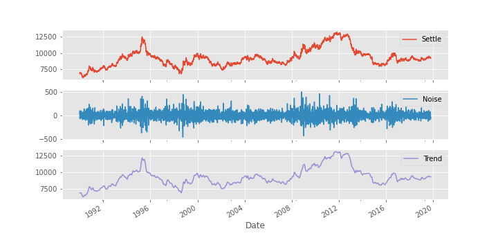
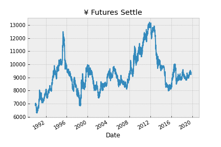
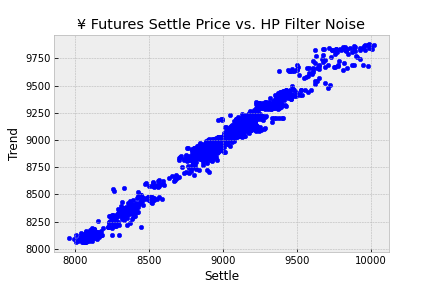
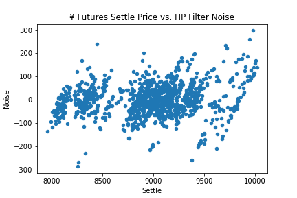
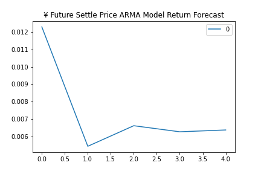
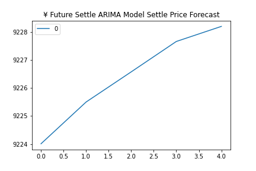
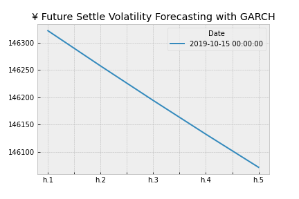
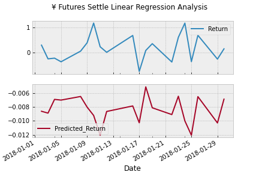
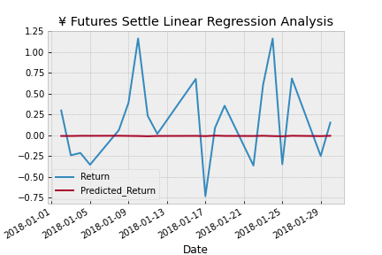

<!--- the header is made with: https://github.com/kyechan99/capsule-render -->

[Illya Nayshevsky, Ph.D.](illya.n@me.com) [](https://www.linkedin.com/in/illyanayshevskyy/)

<br>
Columbia FinTech Bootcamp Assignment

---

### Table of Contents
* [Abstract](#abstract)
* [Data](#data)
* [Python Libraries](#libraries)
* [Time-Series Forecasting](#time-series-forecasting)
* [Regression Analysis](#regression-analysis)

---
## Abstract
### Time-Series Forecasting
Time Series Forecasting and Regression Analysis were performed on [Japanese Yen](https://en.wikipedia.org/wiki/Japanese_yen) (¥) futures dataset. Time series forecasting utilized the [Hodrick-Prescott Filter](https://en.wikipedia.org/wiki/Hodrick%E2%80%93Prescott_filter) methods, [Agressive-moving-average](https://en.wikipedia.org/wiki/Autoregressive%E2%80%93moving-average_model) (ARMA), [Autoregressive integrated moving average](https://en.wikipedia.org/wiki/Autoregressive_integrated_moving_average) (ARIMA) and [Generalized AutoRegressive Conditional Heteroskedasticity](https://www.investopedia.com/terms/g/garch.asp) (GARCH) methodologies.


In an example below a ¥ Futures Settlement price (<span style="color:#b4321f; font-weight: bold">Settle</span>) is decomposed into <span style="color:#1b6791; font-weight: bold">Noise</span> and <span style="color:#5f5d8b; font-weight: bold">Trend</span> using the [Hodrick-Prescott Filter](https://en.wikipedia.org/wiki/Hodrick%E2%80%93Prescott_filter) method.

 


### Linear Regression Analysis
Furthermore, [Linear Regression](https://en.wikipedia.org/wiki/Linear_regression) analysis machine learning model was deployed on the dataset. Linear regression finds the line that best fits the a given time-series dataset (best fit line), thus programmatically finds the slope and the intercept of the dataset. Simple linear regression handles fitting of a 2D dataset, while multiple linear regression fits datasets of higher dimensions.

Example [[Linear Regression - Wikipedia](https://en.wikipedia.org/wiki/Linear_regression)]:


Where the data consists of dependent variable (y) and an independent variable (x).
The data points are denoted in <span style="color:red">red</span> while the dateset mean is denoted as a <span style="color:blue">blue</span> line. The <span style="color:red">data points</span> assumed to be distributed on the y-axis due to random deviations and error associated with data acquisition. The distance between the <span style="color:red">data points</span> and the mean is the error, and is drawn in <span style="color:green">green</span>. 

Linear regression usually utilizes [gradient descent](https://en.wikipedia.org/wiki/Gradient_descent) in order to minimize the error (<span style="color:green">green</span> lines) by varying the slope of the mean (<span style="color:blue">blue</span> line) to ensure the best fit.

---

## Libraries
The date libraries used in the analysis were installed and imported:

```python
import numpy as np
import pandas as pd
from pathlib import Path
```

Matplotlib was used for data visualization:
```python
import matplotlib.pyplot as plt
from matplotlib import style

# Bayesian Methods for Hackers style sheet was used for styling
style.use('bmh')

# matplotlib was run inline for Jupyter Notebook compatibility
%matplotlib inline
```

And warnings were muted for esthetical purpose:
```python
import warnings
warnings.simplefilter('ignore')
```

Furthermore, the following time-series libraries were imported on demand:
```python
# statsmodels contains libraries for Hodrick-Prescott Filter
import statsmodels.api as sm

# stats model contains ARMA and ARIMA library
from statsmodels.tsa.arima_model import ARMA
from statsmodels.tsa.arima_model import ARIMA

# arch containes libraries for GARCH model
from arch import arch_model
```

The sklearn Linear Regression Analysis library used was imported:
```python
from sklearn.linear_model import LinearRegression
```

And, analysis of the Linear Regression model used <code>sklearn.metrics</code> module:

```python
from sklearn.metrics import mean_squared_error
```

R<sup>2</sup> was calculated via the following module:

```python
from sklearn.metrics import r2_score
```


---
## Data
Data utilized in this study is composed of OHLCV (open, high, low, settle, volume) dataset for the ¥ and is contained within a <code>.csv</code> file. 
The data structure is:

```python
columns = ['Date', 'Open', 'High', 'Low', 'Last', 'Change', 'Settle', 'Volume', 'Previous Day Open Interest']
index = ['1976-08-02' : '2019-10-15']
```

For our study only the <code>Date</code> and <code>Settle</code> columns are used. The range was selected to be <code>['1990-01-01' : '2019-10-15']</code>

The <code>Settle</code> price was shown to be:


    
    

---
## Time-Series Forecasting
Time series analysis is a series of data points indexed in the time domain [[Wikipedia](https://en.wikipedia.org/wiki/Time_series)]. In this assignment, 4 additional forecasting methods are used:<br>
* [Hodrick-Prescott Filter Decomposition](#hodrick-prescott-filter-decomposition)
* [ARMA Model Returns Forecasting](#arma-model-returns-forecasting)
* [ARIMA Model Settle Price Forecasting](#arima-model-settle-price-forecasting)
* [Forecasting Volatility with GARCH](#forecasting-volatility-with-garch)

### Hodrick-Prescott Filter Decomposition
#### Overview
[Hodrick-Prescott Filter](https://en.wikipedia.org/wiki/Hodrick%E2%80%93Prescott_filter) decomposes the time-series dataset into trend and noise components, effectively removing the cyclical component from  the raw data. The filter therefore separates the time-series *yt* into the trend component *τt* and cyclical (noise) component *ct*

> *yt = τt + ct*

The components are determined by minimizing a quadratic loss function described here: [[Hodrick–Prescott filter : The Equation](https://www.mathworks.com/help/econ/hpfilter.html#:~:text=The%20Hodrick%2DPrescott%20filter%20decomposes,%3D%20%CF%84t%20%2B%20ct.&text=f%20(%20%CF%84%20t%20)%20%3D%20%E2%88%91,T%20is%20the%20sample%20size.)]

#### Method
The <code>statsmodel</code> library is imported:

```python
import statsmodels.api as sm
```

The <code>hpfilter</code> is then called and the dataframe containing the <code>Settle</code> price is passed:

```python
noise, trend = sm.tsa.filters.hpfilter(yen_futures.Settle)
```

#### Results
The results showed a direct correlation between the <code>Settle</code> price and <code>Trend</code>



However, no correlation was found between <code>Settle</code> price and <code>Noise</code>:




### ARMA Model Returns Forecasting
#### Overview
[Agressive-moving-average](https://en.wikipedia.org/wiki/Autoregressive%E2%80%93moving-average_model) (ARMA) is a corss between Auto-Regressive (*AR(p)*) and Moving Average (*MA(q)*) models. *AR(p)* model try to explain the momentum and mean reversion effects often observed in trading markets and uses past values to predict the future values and assumes some degree of [auto-correlation](https://en.wikipedia.org/wiki/Autocorrelation), while *MA(q)* models try capture the average smoothed average price by creating a series of averages of different subsets and creating a constantly updated average price [[Time Series Analysis for Financial Data IV— ARMA Models - Medium](https://medium.com/auquan/time-series-analysis-for-finance-arma-models-21695e14c999#:~:text=ARMA%20model%20is%20simply%20the,in%20the%20white%20noise%20terms.)]. ARMA model combines the *AR* and *MA* models to predict future values by analyzing past values and errors.


#### Method

ARMA module is imported from <code>statsmodel</code>:

```python
from statsmodels.tsa.arima_model import ARMA
```

AMRA instantiated and <code>Settle</code> price data is passed:

```python
# Estimate and ARMA model using statsmodels (use order=(2, 1))
arma_model = ARMA(returns.Settle, order=(2,1))
```

Followed by model fitting:

```python
# Fit the model
results = model.fit()
```

#### Results

The results were printed to the terminal and were as follows:

<p style="text-align: center;">ARMA Model Return Forecasting</p>

| Dep. Variable: |           Settle |   No. Observations: |      7514 |
|---------------:|-----------------:|--------------------:|----------:|
|         **Model:** |       ARMA(1, 1) |      **Log Likelihood** | -7893.399 |
|        **Method:** |          css-mle | **S.D. of innovations** |     0.692 |
|          **Date:** | Tue, 01 Jun 2021 |                 **AIC** | 15794.798 |
|          **Time:** |         12:06:47 |                 **BIC** | 15822.496 |
|        **Sample:** |                0 |                **HQIC** | 15804.309 |

<br>

|              |    coef | std err |      z | P>\|z\| | [0.025 | 0.975] |
|-------------:|--------:|--------:|-------:|--------:|-------:|-------:|
|        **const** |  0.0063 |   0.008 |  0.830 |   0.406 | -0.009 |  0.021 |
| **ar.L1.Settle** |  0.6985 |   0.188 |  3.712 |   0.000 |  0.330 |  1.067 |
| **ma.L1.Settle** | -0.7112 |   0.185 | -3.850 |   0.000 | -1.073 | -0.349 |

<br><br>

<p style="text-align: center;">Roots</p>

|      |   Real | Imaginary | Modulus | Frequency |
|-----:|-------:|----------:|--------:|----------:|
| **AR.1** | 1.4317 |  +0.0000j |  1.4317 |    0.0000 |
| **MA.1**| 1.4061 |  +0.0000j |  1.4061 |    0.0000 |

*Tables were prepared with [Tables Generator](https://www.tablesgenerator.com/markdown_tables)*


Based on the p-values, the model a good fit, this means that the data is normally distributed.

The 5 day return forecast was then plotted:




### ARIMA Model Settle Price Forecasting
#### Overview
[Autoregressive integrated moving average](https://en.wikipedia.org/wiki/Autoregressive_integrated_moving_average) (ARIMA) is a natural extension to the class of ARMA models — it combines the *AR* and *MA* models, using past values and errors to predict future values. ARIMA model returns differences (*Δy*) of the data [[Time Series Analysis for Financial Data V — ARIMA Models - Medium](https://medium.com/auquan/time-series-analysis-for-finance-arima-models-acb5e39999df)]. ARIMA model includes [Akaike Information Criterion](https://en.wikipedia.org/wiki/Akaike_information_criterion) (AIC) and [Bayesian Information Criterion](https://en.wikipedia.org/wiki/Bayesian_information_criterion) (BIC), which assess how well the model fits and the model's complexity. In general higher-order models are penalized for complexity, and lower scores within these indicators are better.

#### Method
ARIMA module is imported from <code>statsmodel</code>:

```python
from statsmodels.tsa.arima_model import ARIMA
```

For this analysis we have set:

```python
# Instantiate the p, d, q vars
p = 5
d = 1
q = 1
```
Where: 
P = # of Auto-Regressive Lags
D = # of Differences (this is usually =1)
Q = # of Moving Average Lags

```python
# Estimate and ARIMA Model:
model = ARIMA(yen_futures.Settle, order=(p, d, q))
```

And then fit the model:

```python
# Fit the model
results = model.fit()
```

#### Results
The results were printed to the terminal and were as follows:

<p style="text-align: center;">ARIMA Model Settle Price Forecasting</p>

| Dep. Variable: |         D.Settle |   No. Observations: |       7514 |
|---------------:|-----------------:|--------------------:|-----------:|
|         **Model:** |   ARIMA(5, 1, 1) |      **Log Likelihood** | -41944.619 |
|        **Method:** |          css-mle | **S.D. of innovations** |     64.281 |
|          **Date:** | Tue, 01 Jun 2021 |                 **AIC** |  83905.238 |
|          **Time:** |         12:37:49 |                 **BIC** |  83960.635 |
|        **Sample:** |                1 |                **HQIC** |  83924.259 |

<br>

|           coef | std err |     z | P>\|z\| | [0.025 | 0.975] |       |
|---------------:|--------:|------:|--------:|-------:|-------:|-------|
|          **const |  0.3162 | 0.700 |   0.452 |  0.651 | -1.056 | 1.688 |
| **ar.L1.D.Settle** |  0.2824 | 0.699 |   0.404 |  0.686 | -1.088 | 1.653 |
| **ar.L2.D.Settle** |  0.0007 | 0.016 |   0.043 |  0.966 | -0.030 | 0.032 |
| **ar.L3.D.Settle** | -0.0126 | 0.012 |  -1.032 |  0.302 | -0.037 | 0.011 |
| **ar.L4.D.Settle** | -0.0137 | 0.015 |  -0.889 |  0.374 | -0.044 | 0.016 |
| **ar.L5.D.Settle** | -0.0011 | 0.018 |  -0.064 |  0.949 | -0.036 | 0.034 |
| **ma.L1.D.Settle** | -0.2974 | 0.699 |  -0.425 |  0.671 | -1.667 | 1.073 |

<br><br>

<p style="text-align: center;">Roots</p>

|           Real | Imaginary |  Modulus | Frequency |
|---------------:|----------:|---------:|----------:|
|           **AR.1** |    1.8920 | -1.3785j |    2.3410 |
|           **AR.2** |    1.8920 | +1.3785j |    2.3410 |
|           **AR.3** |   -2.2713 | -3.0195j |    3.7784 |
|           **AR.4** |   -2.2713 | +3.0195j |    3.7784 |
|          **AR.5** |  -11.1153 | -0.0000j |   11.1153 |
|           **MA.1** |    3.3626 | +0.0000j |    3.3626 |
| **ma.L1.D.Settle** |   -0.2974 |    0.699 |    -0.425 |


Based on the p-values, the model not a good fit, this means that the data is not normally distributed.

The 5 day ARIMA Model Settle Price Forecasting was then plotted:




### Forecasting Volatility with GARCH
#### Overview
[Generalized AutoRegressive Conditional Heteroskedasticity](https://www.investopedia.com/terms/g/garch.asp) (GARCH) is a statistical model used in analyzing time-series data where the variance error is believed to be autocorrelated. GARCH models assume that the variance of the error follows an autoregressive moving average process. Volatility is the amount of variance over a given time. Uneven variance in a dataset is knows as [Heteroscedasticity](https://en.wikipedia.org/wiki/Heteroscedasticity).

#### Method
GARCH module is imported from <code>arch</code>:

```python
from arch import arch_model
```


```python
# 'p' and 'q'  are akin to the 'p' and 'q' of an ARMA model.
# 'vol="GARCH"' means that we're using a GARCH model.
# The 'mean="Zero"' means that we're estimating a GARCH.
model = arch_model(df.Settle, mean="Zero", vol="GARCH", p=1, q=1)
```

Then the model is fit:

```python
# Fit the model
res = model.fit(disp="off")
```

Furthermore, a 5 day forecast was calculated by calling the <code>forecast</code> function from <code>arch_model</code> module from the last day in the dataset:

```python
# Find the last day of the dataset
last_day = df.index.max().strftime('%Y-%m-%d')

# Create a 5 day forecast of volatility
forecast_horizon = 5

# Start the forecast using the last_day calculated above
forecasts = res.forecast(start=last_day, horizon=forecast_horizon)
```

#### Results
The results were printed to the terminal and were as follows:

<p style="text-align: center;">Zero Mean - GARCH Model Results</p>

| Dep. Variable: |             Settle |        R-squared: |    0.000 |
|---------------:|-------------------:|------------------:|---------:|
|    **Mean Model:** |          Zero Mean |   **Adj. R-squared:** |    0.000 |
|     **Vol Model:** |              GARCH |   **Log-Likelihood:** | -79212.8 |
|  **Distribution:** |             Normal |              **AIC:** |  158434. |
|        **Method:**| Maximum Likelihood |              **BIC:** |  158461. |
|                |                    | **No. Observations:** |     7515 |
|          **Date:** |   Tue, Jun 01 2021 |     **Df Residuals:** |     7511 |
|          **Time:** |           12:57:31 |         **Df Model:**|        4 |

<br>

<p style="text-align: center;">Volatility Model</p>

|          |       coef |   std err |         t |   P>\|t\| |       95.0% Conf. Int. |
|---------:|-----------:|----------:|----------:|----------:|-----------------------:|
|   **omega** | 1.7475e+06 | 1.135e+05 |    15.399 | 1.668e-53 |  [1.525e+06,1.970e+06] |
| **alpha[1]** |     0.9762 | 1.706e-02 |    57.222 |     0.000 |        [ 0.943, 1.010] |
| **alpha[2]** | 2.3745e-03 | 5.384e-02 | 4.410e-02 |     0.965 |       [ -0.103, 0.108] |
|  **beta[1]** |     0.0000 | 5.093e-02 |     0.000 |     1.000 | [-9.982e-02,9.982e-02] |

<br>

The GARCH model forecast was that was obtained with the <code>.forecast()</code> function was then plotted:



---


## Regression Analysis
Regression analysis is a collection of statistical methods for determine the relationships between a dependent variable and one or more independent variables. Regression breaks down into linear and  that most closely fits the data according to a specific mathematical criterion. [[Wikipedia](https://en.wikipedia.org/wiki/Regression_analysis)]

### Regression Analysis: Seasonal Effects with Sklearn Linear Regression
#### Overview
In this analysis, the time-effect (seasonality) has been evaluated in regard to the daily returns of ¥ Futures Settlement price. The model was trained on lagging returns (returns from 1 day before), and then tested on current returns. The efficacy of the model was then evaluated.

#### Method

For this analysis we have isolated price data between the year 1990 and the last available data in the dataset (2019):

```python
yen_futures = yen_futures.loc["1990-01-01":, :]
```

Then, daily returns and lagging returns were calculated:

```python
# calculate daily returns and remove nulls generated by delta
yen_futures['Return'] = yen_futures.Settle.pct_change() * 100
yen_futures.dropna(inplace=True)

# remove any inf's
yen_futures['Return'].replace([np.inf, -np.inf], np.nan, inplace=True)

# calcualte lagged returns and clean up the df
yen_futures['Lagged_Return'] = yen_futures['Return'].shift().dropna()
yen_futures.dropna(inplace=True)
```

Therefore the date was split into <code>train</code> and <code>test</code> dataframes, the <code>train</code> section took all data until the end of year 2017, and the <code>test</code> section took all the data after Jan 1, 2018.

Then the data was split into <code>X</code> and <code>y</code> fragments, with <code>X</code> taking the <code>'Lagged-Return'</code> column and the <code>y</code> taking the <code>'Return'</code> column.

Afterwards, the Linear Regression model was instantiated and fit:

```python
# create a Linear Regression model and fit it to the training data
from sklearn.linear_model import LinearRegression

model = LinearRegression()
model.fit(X_train, y_train)
```

After the model was fit, predictions were made using the <code>test</code> data.

```python
# make a prediction of "y" values using just the test dataset
predictions = model.predict(X_test)
```

Analysis of the model included the Out-of-Sample test via Mean-Square-Error which calculated the Root-Mean-Square-Error:

```python
from sklearn.metrics import mean_squared_error
rmse = np.sqrt(mean_squared_error(
    lr_results["Return"],
    lr_results["Predicted_Return"]
))
```

And the In-Sample Performance test:

```python
# Construct a dataframe using just the "y" training data:
in_sample_results = y_train.to_frame()

# Add a column of "in-sample" predictions to that dataframe:  
in_sample_results["In-sample Predictions"] = model.predict(X_train)

# Calculate in-sample mean_squared_error (for comparison to out-of-sample)
in_sample_rmse = np.sqrt(mean_squared_error(
    in_sample_results["Return"],
    in_sample_results["In-sample Predictions"]
))
```

#### Results
The results of the Linear Regression Analysis concluded a poor model fit performance, with the following results:

<code>Out-of-Sample Root Mean Squared Error (RMSE): 0.415</code>
<code>In-sample Root Mean Squared Error (RMSE): 0.60</code>

The R<sup>2</sup> shows very little correlation: <code>-0.0011</code>

The results were then plotted on 2 subplots:



Analyzing the plots above, we can see some inverse-correlation. But, the amplitude of the data makes it very difficult to be properly fit. Normalizing the data can help eliminate the y-axis range discrepency.

But, with the current y-axis range, overlayed data does not provide any meaningful results:

 
---
