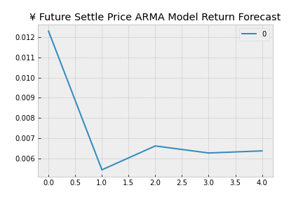
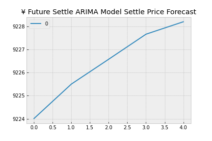

# Time-Series Analysis

[Illya Nayshevsky](www.illya.bio)<br>
Columbia FinTech Bootcamp Assignment

---

### Table of Contents
* [Abstract](#abstract)
* [Data](#data)
* [Time Series Forecasting](#time-series-forecasting)
* [Regression Analysis](#regression-analysis)

---
## Abstract
Time Series Forecasting and Regression Analysis were performed on [Japanese Yen](https://en.wikipedia.org/wiki/Japanese_yen) (¥) futures dataset. Time series forecasting utilized the [Hodrick-Prescott Filter](https://en.wikipedia.org/wiki/Hodrick%E2%80%93Prescott_filter) methods, [Agressive-moving-average](https://en.wikipedia.org/wiki/Autoregressive%E2%80%93moving-average_model) (ARMA), [Autoregressive integrated moving average](https://en.wikipedia.org/wiki/Autoregressive_integrated_moving_average) (ARIMA) and [Generalized AutoRegressive Conditional Heteroskedasticity](https://www.investopedia.com/terms/g/garch.asp) (GARCH) methodologies.


---
## Data
Data utilized in this study is composed of OHLCV (open, high, low, settle, volume) dataset for the ¥ and is contained within a <code>.csv</code> file. 
The data structure is:

```python
columns = ['Date', 'Open', 'High', 'Low', 'Last', 'Change', 'Settle', 'Volume', 'Previous Day Open Interest']
index = ['1976-08-02' : '2019-10-15']
```

For our study only the <code>Date</code> and <code>Settle</code> columns are used. The range was selected to be <code>['1990-01-01' : '2019-10-15']</code>

The <code>Settle</code> price was shown to be:


    
    

---
## Time Series Forecasting
Time series analysis is a series of data points indexed in the time domain [[Wikipedia](https://en.wikipedia.org/wiki/Time_series)]. In this assignment, 4 additional forecasting methods are used:<br>
* [Hodrick-Prescott Filter Decomposition](#hodrick-prescott-filter-decomposition)
* [ARMA Model Returns Forecasting](#arma-model-returns-forecasting)
* [ARIMA Model Settle Price Forecasting](#arima-model-settle-price-forecasting)
* [Forecasting Volatility with GARCH](#forecasting-volatility-with-garch)

### Hodrick-Prescott Filter Decomposition
#### Overview
[Hodrick-Prescott Filter](https://en.wikipedia.org/wiki/Hodrick%E2%80%93Prescott_filter) decomposes the time-series dataset into trend and noise components, effectively removing the cyclical component from  the raw data. The filter therefore separates the time-series *yt* into the trend compoenent *τt* and cyclical (noise) component *ct*

> *yt = τt + ct*

The components are determined by minimizing a quadratic loss function described here: [Hodrick–Prescott filter : The Equation](https://www.mathworks.com/help/econ/hpfilter.html#:~:text=The%20Hodrick%2DPrescott%20filter%20decomposes,%3D%20%CF%84t%20%2B%20ct.&text=f%20(%20%CF%84%20t%20)%20%3D%20%E2%88%91,T%20is%20the%20sample%20size.)

#### Method
The <code>statsmodel</code> library is imported:

```python
import statsmodels.api as sm
```

The <code>hpfilter</code> is then called and the dataframe containing the <code>Settle</code> price is passed:
```python
noise, trend = sm.tsa.filters.hpfilter(df.Settle)
```

#### Results
The results showed a direct correlation between the <code>Settle</code> price and <code>Trend</code>


However, no correlation was found between <code>Settle</code> price and <code>Noise</code>:


### ARMA Model Returns Forecasting
#### Overview
[Agressive-moving-average](https://en.wikipedia.org/wiki/Autoregressive%E2%80%93moving-average_model) (ARMA) is a corss between Auto-Regressive (*AR(p)*) and Moving Avereage (*MA(q)*) models. *AR(p)* model try to explain the momentum and mean reversion effects often observed in trading markets and uses past values to predict the future values and assumes some degree of [auto-correlation](https://en.wikipedia.org/wiki/Autocorrelation), while *MA(q)* models try capture the avarage smoothed average price by creating a series of averages of different subsets and creating a contantly updated average price. [[Time Series Analysis for Financial Data IV— ARMA Models - Medium](https://medium.com/auquan/time-series-analysis-for-finance-arma-models-21695e14c999#:~:text=ARMA%20model%20is%20simply%20the,in%20the%20white%20noise%20terms.)] ARMA model combines the *AR* and *MA* models to predict future values by analyzing past values and errors.


#### Method

ARMA module is imported from <code>statsmodel</code>:

```python
from statsmodels.tsa.arima_model import ARMA
```

AMRA instantiated and <code>Settle</code> price data is passed:

```python
# Estimate and ARMA model using statsmodels (use order=(2, 1))
arma_model = ARMA(returns.Settle, order=(2,1))
```

Followed by model fitting:

```python
# Fit the model
results = model.fit()
```

#### Results

The results were printed to the terminal and were as follows:

<p style="text-align: center;">ARMA Model Return Forecasting</p>

| Dep. Variable: |           Settle |   No. Observations: |      7514 |
|---------------:|-----------------:|--------------------:|----------:|
|         **Model:** |       ARMA(1, 1) |      **Log Likelihood** | -7893.399 |
|        **Method:** |          css-mle | **S.D. of innovations** |     0.692 |
|          **Date:** | Tue, 01 Jun 2021 |                 **AIC** | 15794.798 |
|          **Time:** |         12:06:47 |                 **BIC** | 15822.496 |
|        **Sample:** |                0 |                **HQIC** | 15804.309 |

<br>

|              |    coef | std err |      z | P>\|z\| | [0.025 | 0.975] |
|-------------:|--------:|--------:|-------:|--------:|-------:|-------:|
|        **const** |  0.0063 |   0.008 |  0.830 |   0.406 | -0.009 |  0.021 |
| **ar.L1.Settle** |  0.6985 |   0.188 |  3.712 |   0.000 |  0.330 |  1.067 |
| **ma.L1.Settle** | -0.7112 |   0.185 | -3.850 |   0.000 | -1.073 | -0.349 |

<br><br>

<p style="text-align: center;">Roots</p>

|      |   Real | Imaginary | Modulus | Frequency |
|-----:|-------:|----------:|--------:|----------:|
| **AR.1** | 1.4317 |  +0.0000j |  1.4317 |    0.0000 |
| **MA.1**| 1.4061 |  +0.0000j |  1.4061 |    0.0000 |

*Tables were prepated with [Tables Generator](https://www.tablesgenerator.com/markdown_tables)*


Based on the p-values, the model a good fit, this means that the data is normally distributed.

The 5 day return forecast was then plotted:




### ARIMA Model Settle Price Forecasting
#### Overview
[Autoregressive integrated moving average](https://en.wikipedia.org/wiki/Autoregressive_integrated_moving_average) (ARIMA) is a natural extension to the class of ARMA models — it combines the *AR* and *MA* models, using past values and errors to predict future values. ARIMA model returns differences (*Δy*) of the data. [[Time Series Analysis for Financial Data V — ARIMA Models - Medium](https://medium.com/auquan/time-series-analysis-for-finance-arima-models-acb5e39999df)] ARIMA model includes [Akaika Information Criterion](https://en.wikipedia.org/wiki/Akaike_information_criterion) (AIC) and [Baysian Information Criterion](https://en.wikipedia.org/wiki/Bayesian_information_criterion) (BIC), which assess how well the model fits and the model's complexity. In general higher-order models are penalized for complexity, and lower scores within these indicators are better.

#### Method
ARIMA module is imported from <code>statsmodel</code>:

```python
from statsmodels.tsa.arima_model import ARIMA
```

For this analysis we have set:

```python
# Instantiate the p, d, q vars
p = 5
d = 1
q = 1
```
Where: 
P = # of Auto-Regressive Lags
D = # of Differences (this is usually =1)
Q = # of Moving Average Lags

```python
# Estimate and ARIMA Model:
model = ARIMA(df.Settle, order=(p, d, q))
```

And then fit the model:

```python
# Fit the model
results = model.fit()
```

#### Results
The results were printed to the terminal and were as follows:

<p style="text-align: center;">ARIMA Model Settle Price Forecasting</p>

| Dep. Variable: |         D.Settle |   No. Observations: |       7514 |
|---------------:|-----------------:|--------------------:|-----------:|
|         **Model:** |   ARIMA(5, 1, 1) |      **Log Likelihood** | -41944.619 |
|        **Method:** |          css-mle | **S.D. of innovations** |     64.281 |
|          **Date:** | Tue, 01 Jun 2021 |                 **AIC** |  83905.238 |
|          **Time:** |         12:37:49 |                 **BIC** |  83960.635 |
|        **Sample:** |                1 |                **HQIC** |  83924.259 |

<br>

|           coef | std err |     z | P>\|z\| | [0.025 | 0.975] |       |
|---------------:|--------:|------:|--------:|-------:|-------:|-------|
|          **const |  0.3162 | 0.700 |   0.452 |  0.651 | -1.056 | 1.688 |
| **ar.L1.D.Settle** |  0.2824 | 0.699 |   0.404 |  0.686 | -1.088 | 1.653 |
| **ar.L2.D.Settle** |  0.0007 | 0.016 |   0.043 |  0.966 | -0.030 | 0.032 |
| **ar.L3.D.Settle** | -0.0126 | 0.012 |  -1.032 |  0.302 | -0.037 | 0.011 |
| **ar.L4.D.Settle** | -0.0137 | 0.015 |  -0.889 |  0.374 | -0.044 | 0.016 |
| **ar.L5.D.Settle** | -0.0011 | 0.018 |  -0.064 |  0.949 | -0.036 | 0.034 |
| **ma.L1.D.Settle** | -0.2974 | 0.699 |  -0.425 |  0.671 | -1.667 | 1.073 |

<br><br>

<p style="text-align: center;">Roots</p>

|           Real | Imaginary |  Modulus | Frequency |
|---------------:|----------:|---------:|----------:|
|           **AR.1** |    1.8920 | -1.3785j |    2.3410 |
|           **AR.2** |    1.8920 | +1.3785j |    2.3410 |
|           **AR.3** |   -2.2713 | -3.0195j |    3.7784 |
|           **AR.4** |   -2.2713 | +3.0195j |    3.7784 |
|          **AR.5** |  -11.1153 | -0.0000j |   11.1153 |
|           **MA.1** |    3.3626 | +0.0000j |    3.3626 |
| **ma.L1.D.Settle** |   -0.2974 |    0.699 |    -0.425 |


Based on the p-values, the model not a good fit, this means that the data is not normally distributed.

The 5 day ARIMA Model Settle Price Forecasting was then plotted:




### Forecasting Volatility with GARCH
#### Overview
[Generalized AutoRegressive Conditional Heteroskedasticity](https://www.investopedia.com/terms/g/garch.asp) (GARCH) is a statistical model used in analyzing time-series data where the variance error is believed to be autocorrelated. GARCH models assume that the variance of the error follows an autoregressive moving average process. Volatility is the amount of variance over a given time. Uneven variance in a dataset is knows as [Heteroscedasticity](https://en.wikipedia.org/wiki/Heteroscedasticity).

#### Method
GARCH module is imported from <code>arch</code>:

```python
from arch import arch_model
```


```python
# 'p' and 'q'  are akin to the 'p' and 'q' of an ARMA model.
# 'vol="GARCH"' means that we're using a GARCH model.
# The 'mean="Zero"' means that we're estimating a GARCH.
garch_model = arch_model(yen_futures.Settle, mean="Zero", vol="GARCH", p=1, q=1)
```

Then the model is fit:

```python
# Fit the model
res = model.fit(disp="off")
```

Furthermore, a 5 day forecast was calculated by calling the <code>forecast</code> funcation from <code>arch_model</code> module from the last day in the dataset:

```python
# Find the last day of the dataset
last_day = returns.index.max().strftime('%Y-%m-%d')

# Create a 5 day forecast of volatility
forecast_horizon = 5

# Start the forecast using the last_day calculated above
forecasts = garch_res.forecast(start=last_day, horizon=forecast_horizon)
```

#### Results
The results were printed to the terminal and were as follows:

<p style="text-align: center;">Zero Mean - GARCH Model Results</p>

| Dep. Variable: |             Settle |        R-squared: |    0.000 |
|---------------:|-------------------:|------------------:|---------:|
|    **Mean Model:** |          Zero Mean |   Adj. R-squared: |    0.000 |
|     **Vol Model:** |              GARCH |   Log-Likelihood: | -79212.8 |
|  **Distribution:** |             Normal |              AIC: |  158434. |
|        **Method:**| Maximum Likelihood |              BIC: |  158461. |
|                |                    | No. Observations: |     7515 |
|          **Date:** |   Tue, Jun 01 2021 |     Df Residuals: |     7511 |
|          **Time:** |           12:57:31 |         Df Model: |        4 |

<br>

<p style="text-align: center;">Volatility Model</p>

|          |       coef |   std err |         t |   P>\|t\| |       95.0% Conf. Int. |
|---------:|-----------:|----------:|----------:|----------:|-----------------------:|
|   **omega** | 1.7475e+06 | 1.135e+05 |    15.399 | 1.668e-53 |  [1.525e+06,1.970e+06] |
| **alpha[1]** |     0.9762 | 1.706e-02 |    57.222 |     0.000 |        [ 0.943, 1.010] |
| **alpha[2]** | 2.3745e-03 | 5.384e-02 | 4.410e-02 |     0.965 |       [ -0.103, 0.108] |
|  **beta[1]** |     0.0000 | 5.093e-02 |     0.000 |     1.000 | [-9.982e-02,9.982e-02] |

<br>

The GARCH model forecast was that was obtained with the <code>.forecast()</code> function was then plotted:


## Regression Analysis
Regression analysis is a collection of statistical methods for determine the relationships between a dependent variable and one or more independent variables. Regression breaks down into linear and  that most closely fits the data according to a specific mathematical criterion. [[Wikipedia](https://en.wikipedia.org/wiki/Regression_analysis)]