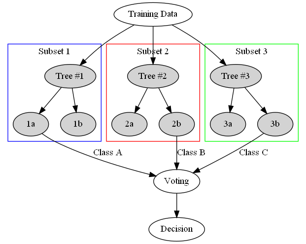

<!-- header is made with: https://github.com/kyechan99/capsule-render -->

[Illya Nayshevsky, Ph.D.](http://www.illya.bio) [](https://www.linkedin.com/in/illyanayshevskyy/)

<br>
Columbia FinTech Bootcamp Assignment

---

### Table of Contents
* [Abstract](#abstract)
* [Requirements](#requirements)
* [Data](#data)
* [Credit Risk Resampling](#credit-risk-resampling)
* [Credit Risk Ensemble](#credit-risk-ensemble)


---

## Abstract

This excersize predicts credit risk with machine learning techniques. 

Historically, loan data is imbalanced, with far more loan approvals than rejections. This imbalance stems from the low applicant rejection rates which are belived to be caused by applicant's due diligence prior to loan application. Basically, people apply to loans that they think they will get. The imbalance in the data creates a problem in machine learning, where a model which is trained on imbalanced data will overwhealmingly predict the most probable outcome, neglecting the criteria of negative outcomes completely.

This issue is addressed by re-sampling, where over undersampling samples the majority class of the dataset, while oversampling copies the minority class, both of which methods create equal weighed classes. 


*Source: [Analystic Vidhya](https://www.analyticsvidhya.com/blog/2020/07/10-techniques-to-deal-with-class-imbalance-in-machine-learning/)*

Re-sampling can be achieved via <code>imbalanced-learn</code> library, which provides a variety of tools for handling imbalanced datasets :  

* Oversampling:
    * <code>RandomOverSampler</code>
    * <code>SMOTE</code>

* Undersampling:
    * <code>ClusterCentroids</code>

* Over/Under-sampling
    * <code>SMOTEEN</code>
    
The learning models used in this excersize are: [Logistic Regression](https://en.wikipedia.org/wiki/Logistic_regression) and [Random Forest](https://en.wikipedia.org/wiki/Random_fores).

Logistic Regression model is used to model probablity of events with binary outcomes. The model outcome is a sigmoid, the classification is performed via a threshold. Passing the threshold value classifies the the training value either as Pass (1) or Fail (0).


 
Random Forest model constructs a multitude of decision trees at training time and outputs a the mode (classification) or the mean (regression) of the individual trees. Random Forest model corrects the over-fitting problem in machine learning. The training data passes throuhg *n*-number of "Trees", returning weighed classes, upon which the final classification is made.



---

## Requirements

Latest version of [Anaconda](https://www.anaconda.com/products/individual) or [Conda](https://docs.conda.io/en/latest/) are required. [Jupyter Notebook](https://jupyter.org/) or [Jupyter Lab](https://jupyterlab.readthedocs.io/en/stable/) must be installed.


```python
numpy==1.20.2 
pandas==1.2.4 

# scikit-learn : machine learning in python; predictive data analysis
scikit-learn==0.24.2 

# imbalanced-learn : provides tools when dealing with classification with imbalanced classes
imbalanced-learn==0.8.0 
```

### Installing requirements

All requirements for this assignment can be installed in a conda environment, along with other requirements for other CU FinTech assignments.

It is important to create a new conda enviroment prior to intalling requirements from <code>requirements.txt</code> file, in order to preserve the current requirements in your <code>(base)</code> environement.

Creating a new enviromental and installing requirements can be done in one step:

```python
conda create --name <env> --file requirements.txt
```

If you already have an environment that you prefer to use, you can install the requirements into that environement like this:

```python
conda install --file requirements.txt
```

---

## Data

Analytical data was provided, and was sourced from LendingClub.
Data was prepared in similar was for both [Credit Risk Resampling](#credit-risk-resampling) and [Credit Risk Ensemble](#credit-risk-ensemble) machine learning methods.

### Data preparation

1. Encoding non-numerical data - create columns and fill binary

```python
# get non-numerical data types
list(df_data_types[df_data_types.iloc[:,0] != 'float64'].index)

# binarification of non-numerical data
pd.get_dummies(df : pd.DataFrame, columns : list)
```

2. <code>X</code> and <code>y</code> split - independant and dependant variables

3. Train/test split (75/25 split)

```python
from sklearn.model_selection import train_test_split

# train_test_split returns train/test X: pd.DataFrame and y: pd.Series 
train_test_split(X : pd.DataFrame , y : pd.Series, random_state : int)
```

4. Scaling data - standardize features by removing the mean and scaling to unit variance

```python
from sklearn.preprocessing import StandardScaler

# Create intance and fit the scaler
scaler = StandardScaler()
X_scaler = scaler.fit(X_train : pd.DataFrame)

# apply StandardScaler() to scale the data
X_train_scaled = X_scaler.transform(X_train : pd.DataFrame)
X_test_scaled = X_scaler.transform(X_test : pd.DataFrame)
```

The scaler has produced two s

## Credit Risk Resampling

Credit risk

---

## Credit Risk Ensemble

Ensable learning was performed on [<code>LoanStats</code>](Resources/LoanStats_2019Q1.csv) data. The calculations were performed in the [<code>credit_risk_ensemble.ipynb</code>](credit_risk_ensemble.ipynb) notebook. 

### Ensamble Learners


[Ensemble learning](https://en.wikipedia.org/wiki/Ensemble_learning) is a machine learning process that utilizes multiple models in order to optimize learning results. Ensamble learners use classifier algorithms, that are strategically arranged in order to increase learning rate, accuracy or prescision, compared to using those algorithms alone.

**Credit risk prediction**

In this study, <code>loan_status</code> was predicted based on a multitude of other loan applicant criteria. The possible outcomes were binary: <code>high_risk</code> or <code>low_risk</code>. 

Two types of ensemble learners were utilized, and their results were compared. Both are a part of the **imbalanced-learn** library.

1. [BalancedRandomForestClassfier()](https://imbalanced-learn.org/stable/references/generated/imblearn.ensemble.BalancedRandomForestClassifier.html) : a balanced random forest classifier - randomly under-samples data to balance it.
2. [EasyEnsembleClassifier()](https://imbalanced-learn.org/stable/references/generated/imblearn.ensemble.EasyEnsembleClassifier.html) : an ensemble of [Adaptive Boosting](https://en.wikipedia.org/wiki/AdaBoost) (AdaBoost) learners - randomly under-samples data to balance it.

**Balanced Random Forest Classfier**

For production run, the <code>n_estimators</code> was wet to 5000 iterations. For reproducibility, the same <code>random_state</code> value was used for all tests.

After [data preparation]("#data"), the enseble classifier was instantiated and fitted:

```python
from imblearn.ensemble import BalancedRandomForestClassfier
brf = BalancedRandomForestClassfier(n_estimators : int, random_state :  int)
model = brf.fit(X_train_scaled : pd.DataFrame, y_train : pd.Series)
```

The scaled X test data was then passed to the mode:

```python
y_pred = model.predict(X_test_scaled : pd.DataFrame)
```

**Results**

Balanced Random Forest Classifier has returned the following results:


> Balanced Accuracy = <code>0.787</code>

> Confusion Matrix:

|   | Pred-0 | Pred-1 |
|--:|-------:|-------:|
| **0** |  15556 |   1545 |
| **1** |     35 |     69 |

> *f1* score = <code>0.95</code>


#### EasyEnsembleClassifier()

After [data preparation]("#data"), the enseble classifier was instantiated and fitted:

```python
from imblearn.ensemble import EasyEnsembleClassifier
eec = EasyEnsembleClassifier(n_estimators : int, random_state :  int)
model = eec.fit(X_train_scaled : pd.DataFrame, y_train : pd.Series)
```

The scaled X test data was then passed to the mode:

```python
y_pred = model.predict(X_test_scaled : pd.DataFrame)
```

The training result produced 