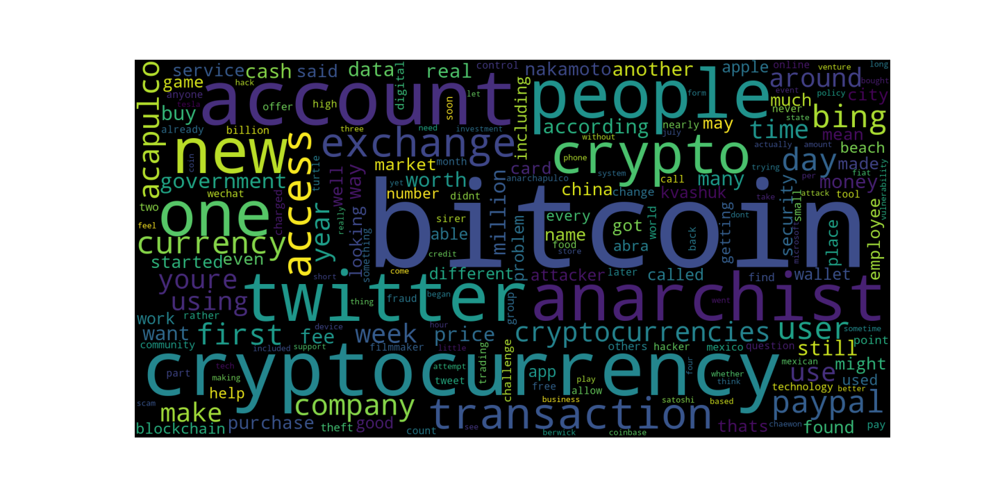

<!-- header is made with: https://github.com/kyechan99/capsule-render -->

[Illya Nayshevsky, Ph.D.](http://www.illya.bio) [](https://www.linkedin.com/in/illyanayshevskyy/)

<br>
Columbia FinTech Bootcamp Assignment

---

### Table of Contents
* [Overview](#overview)
* [Requirements](#requirements)
* [Data](#data)
* [Sentiment Analysis](#sentiment-analysis)
* [Natural Language Processing](#natural-language-processing)
* [Named Entity Recognition](#named-entity-recognition)

---

## Overview

Natural language processing was used to derive Sentiment Analysis, Frequency Analysis and perform Named Entity Recognition (NER) a corpus of recent Bitcoin and Ethereum news articles. 100 articles were used for each cryptocurrency. The analysis returned:

1. Sentiment analysis in form of positive, negative and neutral sentiment 
2. Frequency analysis results consisting most common word pairs
2. Frequency analysis in form of a word cloud of most prevalent words in the articles
3. Rendered NER text highlighting all entities

---

## Requirements

A new [conda](https://docs.conda.io/en/latest/) environment and [Jupyter Notebook/Lab](https://jupyter.org/) are required to run the code.

The following libraries were used:

1. [Natural Language Toolkit (NLTK)](https://www.nltk.org/) - leading platform for building Python programs to work with human language data.
2. [NewsAPI](https://newsapi.org/) - source of articles and breaking news headlines from news sources and blogs across the web
3. [spaCy](https://spacy.io/) - language processing


All of the packages can be installed from terminal:

```python
pip install pandas
pip install python-dotenv
pip install nltk
pip install matplotlib
pip install newsapi-python
pip install -U spacy
python -m spacy download en_core_web_sm
```

Or, can be installed at the point of env creation:
```python
conda create --name <env> --file reqs.txt
```

---

## Data

### Data source
The data used in language processing analysis was from NewsAPI. 100 Bitcoin and 100 Ethereum articles in English:

```python
newsapi.get_everything(q=str<coin name>, language='en', page=int<i>)['articles'] 
# where page corresponds to a multiple of 20 articles (ex. 60 articles :  page=3)
```

### Preparation and cleaning

#### Sentiment analysis data preparation
Sentiment analysis was performed on a pristine corpus of articles. 

#### Frequency analysis data preparation

* The following libraries were used:

1. [Punkt tokenizer models](https://www.nltk.org/_modules/nltk/tokenize/punkt.html) - tokenizer model that was built using unsupervised algorithm that  divides a text into a list of sentences. It then builds a model for abbreviation of words, collocations, and words that start sentences. 

```python
nltk.download('punkt')
```
2. [Wordnet](https://wordnet.princeton.edu/) - lexical database of English language. Nouns, verbs, adjectives and adverbs are grouped into sets of cognitive synonyms (synsets), each expressing a distinct concept. 

```python
nltk.download('wordnet')
```

3. [Stopwords](https://gist.github.com/sebleier/554280) - list of stopwords in English language.

```python
nltk.download('stopwords')
```

* The corpus of articles was cleaned-up:

1. Removed punctuation from text

```python
import re
from string import punctuation
regex = re.compile("[^a-zA-Z ]")
regex.sub('', <corpus>)
```

2. Tokenized - [[Python - Word Tokenization](https://www.tutorialspoint.com/python_data_science/python_word_tokenization.htm)]

```python
from nltk.tokenize import word_tokenize, sent_tokenize
[words,...] = word_tokenize(re_clean)
```

3. Lemmatized -[[Python - Stemming and Lemmatization](https://www.tutorialspoint.com/python_data_science/python_stemming_and_lemmatization.htm)]

```python
from nltk.stem import WordNetLemmatizer, PorterStemmer
lemmatizer = WordNetLemmatizer()
lemmatizer.lemmatize('word')
```

4. Removed stopwords - [[Stopwords](https://en.wikipedia.org/wiki/Stop_word)]

```python
from nltk.corpus import stopwords
custom_sw = ['char','tec','inc','say','via','bos']
```

In addition to all of the above, all words were made lowercase, and all words less than 3 characters were removed. 

#### Named Entity Recognition data preparation

A list of characters was removed from the corpus

```python
rep_list = ['\r','\n','\xa0','[', ']','+','chars','-','\\']
```


---

## Sentiment Analysis

[Sentiment analysis](https://en.wikipedia.org/wiki/Sentiment_analysis) utilizes natural language processing and text analysis to identify meaning and tone. It is able to identify whether the text is positive, negative or neutral. 

### Method

[Natural Language Toolkit (NLTK)](https://www.nltk.org/) library was used to derive the cryptocurrency sentiment based on lexicon and other language rules. [Valance Aware Dictionary and Sentiment Reasoner (VADER)](https://github.com/cjhutto/vaderSentiment) was used, with [<code>vader_dictionary</code>](https://github.com/cjhutto/vaderSentiment/blob/master/vaderSentiment/vader_lexicon.txt) as a reference dictionary.


```python
import nltk as nltk
nltk.download('vader_lexicon')
from nltk.sentiment.vader import SentimentIntensityAnalyzer
```

[<code>SentimentIntensityAnalysis()</code>](https://www.nltk.org/api/nltk.sentiment.html) method was used, which assigns sentiment intensity score to sentences.

### Results

#### Bitcoin

Sentiment analysis of 100 Bitcoin articles showed that neutral sentiment has prevailed, with mean neutral score of <code>0.903</code>.

|       | compound | positive | negative | neutral |
|------:|:--------:|:--------:|:--------:|:-------:|
| count |  100.000 |  100.000 |  100.000 | 100.000 |
|  mean |   0.034  |   0.054  |   0.043  |  0.903  |
|   std |   0.408  |   0.068  |   0.052  |  0.079  |
|   min |  -0.763  |   0.000  |   0.000  |  0.677  |
|   25% |  -0.273  |   0.000  |   0.000  |  0.847  |
|   50% |   0.000  |   0.040  |   0.000  |  0.919  |
|   75% |   0.350  |   0.078  |   0.074  |  0.959  |
|   max |   0.846  |   0.282  |   0.203  |  1.000  |


#### Ethereum

Sentiment analysis of 100 Ethereum articles showed that neutral sentiment has prevailed, with mean neutral score of <code>0.894</code>.

|       | compound | positive | negative | neutral |
|------:|:--------:|:--------:|:--------:|:-------:|
| count |  100.000 |  100.000 |  100.000 | 100.000 |
|  mean |   0.093  |   0.060  |   0.036  |  0.894  |
|   std |   0.366  |   0.062  |   0.055  |  0.119  |
|   min |  -0.869  |   0.000  |   0.000  |  0.000  |
|   25% |  -0.178  |   0.000  |   0.000  |  0.851  |
|   50% |   0.000  |   0.058  |   0.000  |  0.921  |
|   75% |   0.402  |   0.097  |   0.069  |  0.954  |
|   max |   0.778  |   0.246  |   0.286  |  1.000  |


#### Conclusion

* BTC has the highest mean + score : 0.09
* BTC has the highest compound score : 0.25
* BTC has the highest positive score : 0.28

---

## Natural Language Processing

### NGrams and Frequency Analysis

NGram is a contiguous sequence of *n* items of text or speech withing the corpus of text. Frequency analysis provides a word count of text or speech withing the corpus of text.

Ngrams with *n* = 2 were generated in order to visualize words of contiguous sequence within the corpus of text.

```python
from collections import Counter
from nltk import ngrams

n_grams = ngrams([[tokens],...], n=2)
```

Then word clouds were generated to visualize word frequency within the corpus of articles.

```python
from wordcloud import WordCloud
import matplotlib.pyplot as plt

wc = WordCloud(width=1600, height=800).generate('string of words')
plt.imshow(wc)
```

### Results
#### Bitcoin

At the time of analysis (6/13/2021) the word pair "bitcoin" and "cash" showed highest frequency.

|   |      tokens      | count |
|--:|:----------------:|:-----:|
| 0 |  (bitcoin, cash) |   7   |
| 1 |      (year, ago) |   6   |
| 2 |   (white, paper) |   6   |
| 3 |  (bitcoin, flip) |   5   |
| 4 |     (one, count) |   5   |
| 5 |   (credit, card) |   5   |
| 6 |     (make, sure) |   5   |
| 7 | (email, address) |   5   |
| 8 |      (buy, sell) |   5   |
| 9 | (worth, bitcoin) |   4   |

Single word frequency was dominated by "bitcoin".




#### Ethereum

At the time of analysis (6/9/2021) the word pair "ethereum" and "foundation" showed highest frequency.

|   |         tokens         | count |
|--:|:----------------------:|:-----:|
| 0 | (ethereum, foundation) |   19  |
| 1 |    (ethereum, classic) |   15  |
| 2 |    (blockchain, event) |   9   |
| 3 |        (bitcoin, cash) |   8   |
| 4 |     (ethereum, meetup) |   8   |
| 5 |         (author, owns) |   6   |
| 6 |          (owns, small) |   6   |
| 7 | (sessions, blockchain) |   6   |
| 8 |     (vitalik, buterin) |   6   |
| 9 |    (version, ethereum) |   5   |

Single word frequency was dominated by "ethereum".


---

## Named Entity Recognition

Named entity recognition locates and classifies named entities mentioned in unstructured text into pre-defined categories. All entities were tagged in text and labeled.

SpaCy was utlized to extract named entities. 


```python
import spacy
from spacy import displacy

nlp = spacy.load('en_core_web_sm')
doc = nlp('string of text')
displacy.render(doc, style='ent')
```


