<!-- header is made with: https://github.com/kyechan99/capsule-render -->

[Illya Nayshevsky, Ph.D.](http://www.illya.bio) [](https://www.linkedin.com/in/illyanayshevskyy/)

<br>
Columbia FinTech Bootcamp Assignment

---

### Table of Contents
* [Overview](#overview)
* [Requirements](#requirements)
* [Blockchain Setup](#blockchain-setup)
* [Transacting on Blockchain](#transacting-on-blockchain)

---

## Overview

A test Ethereum blockchain was set up to demonstrate blockchain capabilities and executing test transaction. A test net allows for a test environment where transaction can be executed in *test cryptocurrency* that has no real value. Go Ethereum ()<code>geth</code>) was used to build the blockchain. MyCrypto application was used to connect to the test network and execute transactions.

## Requirements

1. [Geth](https://geth.ethereum.org/) - Go Ethereum, the official Go implementaiton of Ethereum protocol.
2. [MyCrypto](https://mycrypto.com/) - MyCrypto is an open-source tool that allows you to manage your Ethereum accounts privately and securely.


## Blockchain Setup

### 1. Creating accounts for two nodes

Setting up two node blockchain - <code>cd</code> into the directory containing <code>geth</code>

```bash
./geth --datadir node1 account new
./geth --datadir node2 account new
```

When prompted enter the password for each node respectively.
Copy the public key and the path to the secret key file (<mark>outlined in yellow</mark>).
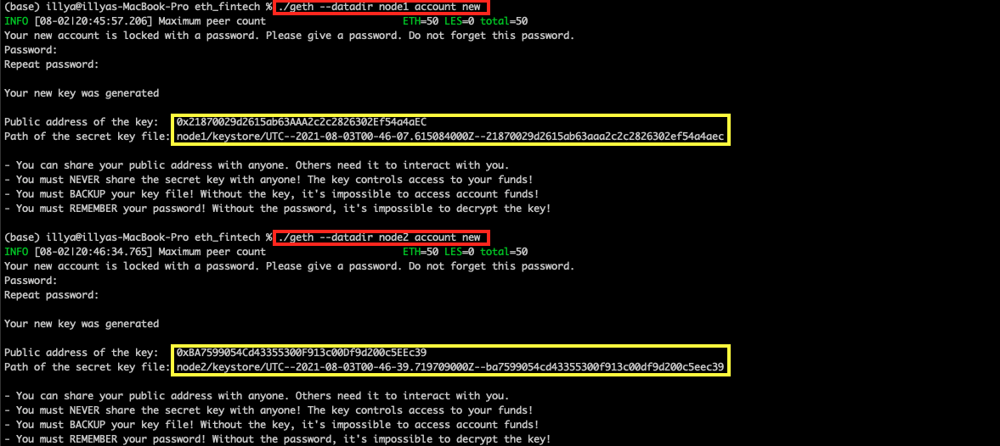


### 2. Generating genesis block

The genesis block is generated with <code>puppeth</code>

```bash
./puppeth
```

1. Enter a network name to administer (no spaces, hyphens or capital letters please)

```bash
> fintech
```

2. What would you like to do? (default = stats).
  * Select option <code>2. Configure new genesis</code>


3. What would you like to do? (default = create).
  * Select option <code>1. Create new genesis from scratch</code>


4. Which consensus engine to use? (default = clique).
  * Select option <code>2. Clique - proof-of-authority</code>


5. How many seconds should blocks take? (default = 15).
  * Enter <code>15</code> seconds.


6. Which accounts are allowed to seal? (mandatory at least one).
  * Enter accounts generated in step 1. Press <code>Enter</code> after entering 2 public addresses.
```bash
> 0x21870029d2615ab63AAA2c2c2826302Ef54a4aEC
> 0xBA7599054Cd43355300F913c00Df9d200c5EEc39
> 0x
```

7. Which accounts should be pre-funded? (advisable at least one)
  * Enter accounts generated in step 1. Press <code>Enter</code> after entering 2 public addresses.
```bash
> 0x21870029d2615ab63AAA2c2c2826302Ef54a4aEC
> 0xBA7599054Cd43355300F913c00Df9d200c5EEc39
> 0x
```
8. Should the precompile-addresses (0x1 .. 0xff) be pre-funded with 1 wei? (advisable yes).
  * Enter <code>no</code>


9. Specify your chain/network ID if you want an explicit one (default = random).
```bash
> 200
```
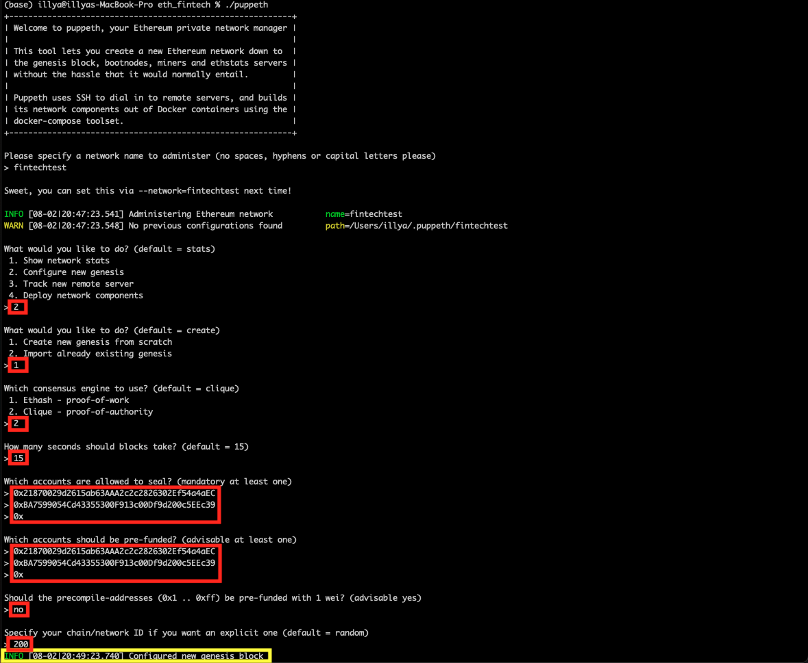


10. What would you like to do? (default = stats).
  * Select option <code>2. Manage existing genesis</code>
  * Select option <code>2. Export genesis configurations</code>
  * Press <code>Enter</code> - this will place the files in the default directory where <code>geth</code> and <code>puppeth</code> are located.

  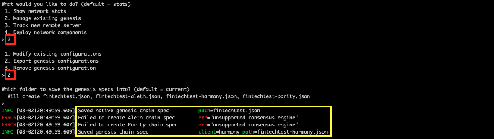

  * Although <code>Aleth</code> and <code>Parity</code> will fail to generate, they are not needed. <mark>Output is outlined in yellow</mark>

11. To close <code>puppeth</code> by pressing <code>Control + C</code> (on MacOS).


### 3. Initialize the nodes

1. The nodes are initialized with <code>./geth</code>, by passing the *node name* into <code>directory</code> flag and *genesis block JSON file* into <code>init</code> flag.
```bash
./geth --datadir node1 init fintechtest.json
./geth --datadir node2 init fintechtest.json
```
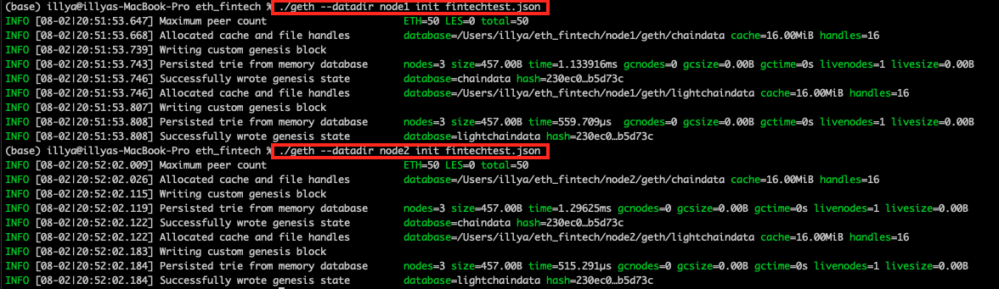

2. Run the first node (node1)
* <code>./geth</code> <code>--datadir</code> flag should be set to <code>node1</code>
* set <code>--unlock</code> flag to node1's public key
* enable mining by setting the <code>--mining</code> flag
* set [RPC](https://www.jsonrpc.org/specification) (remote procedure call) flag
* setting <code>--allow-insecure-unlock</code> flag.
```bash
./geth --datadir node1 --unlock "0x21870029d2615ab63AAA2c2c2826302Ef54a4aEC" --mine --rpc --allow-insecure-unlock
```

3. Once the node is launched, scroll up to <code>Started P2P networking</code> and copy the address, <mark>highlighted in yellow</mark>:
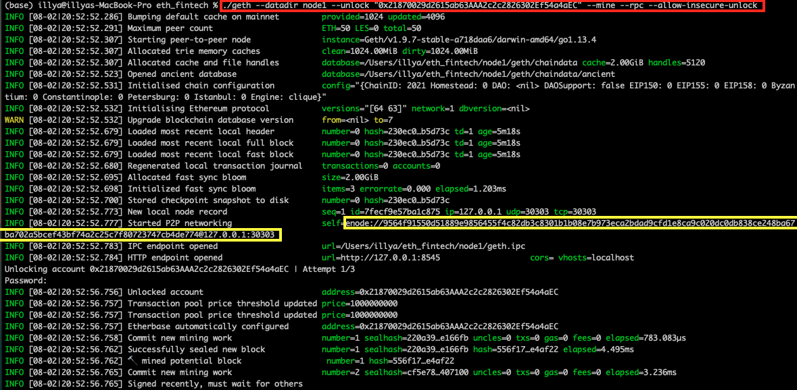

  The output should state that the node is *Unlocked*

4. Run the second node (node2)
  * Running the second node will require opening a second instance of terminal application
  * <code>./geth</code> <code>--datadir</code> flag should be set to <code>node2</code>
  * set the <code>--unlock</code> flag to the node2's public key
  * set <code>--mine</code> flag
  * set <code>--port</code> flag to <code>30304</code>
  * pass the *enode* address into <code>--bootnodes</code> flag as a string
  * (if running on Windows) set <code>--ipcdisable</code>
  * set <code>--allow-insecure-unlock</code> flags

  ```bash
./geth --datadir node2 --unlock "0xBA7599054Cd43355300F913c00Df9d200c5EEc39" --mine --port 30304 --bootnodes "enode://9564f91550d51889e9856455f4c82db3c8301b1b08e7b973eca2bdad9cfd1e8ca9c020dc0db838ce248ba67ba702a5bcef43bf74a2c25c7f80723747cb4de774@127.0.0.1:30303" --ipcdisable --allow-insecure-unlock
```

  The output should state that the node is *Unlocked* and block are being mined.

  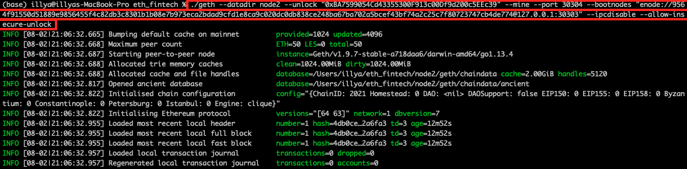

## Transacting on Blockchain

### MyCrypto Set-up

1. Setting up a *Custom Network*
  * Click <code>Change Network</code> on the bottom left; then select <code>Add Custom Node</code>
  * Enter the *Node Name*
  * Select <code>Custom</code> from the *Network* dropdown menu
  * Enter the *Network Name*
  * Enter <code>ETH</code> in the *Currency* field
  * Enter the network's chain ID in the *Chain ID* field (our chain ID was set to <code>111</code> in step **2i**)
  * Set the *URL* to <code>http://127.0.0.1:4585</code>

  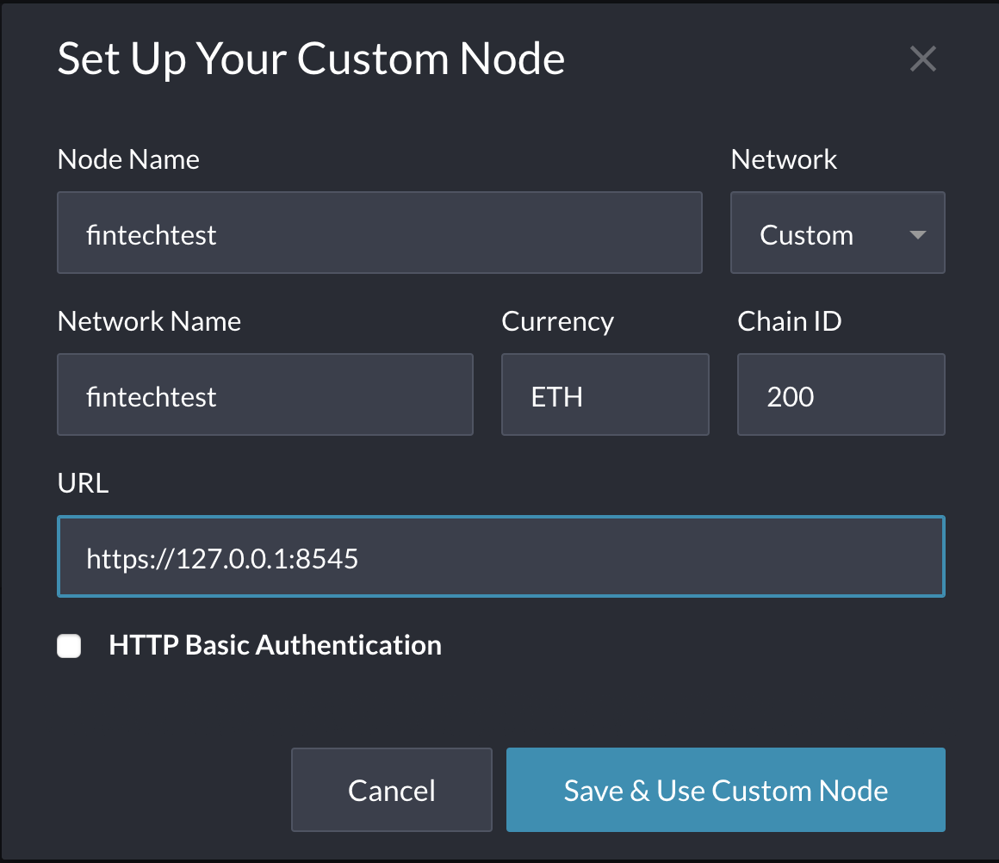


2. Import account
  * An account cant be imported by importing a <code>keystore</code> file.
  * The keystore file can be loaded from <code>~/node1/keystore/"keystore_file"</code>

  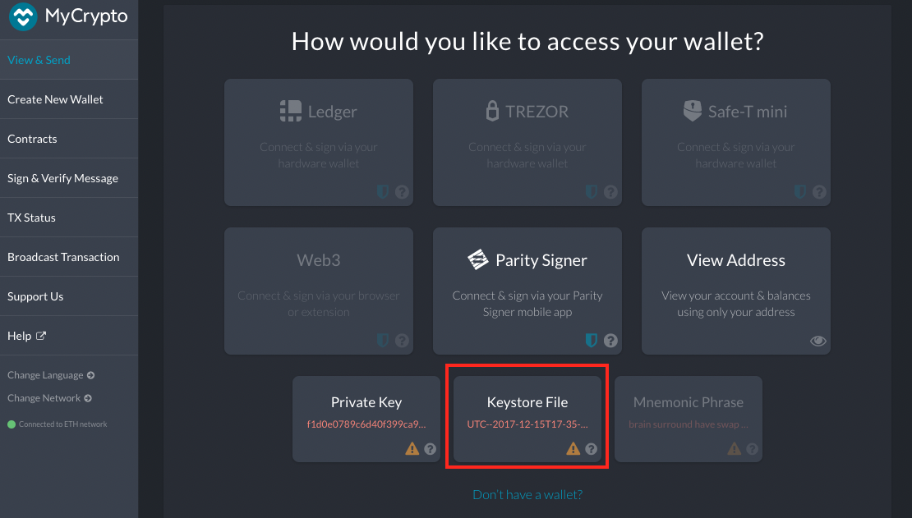
  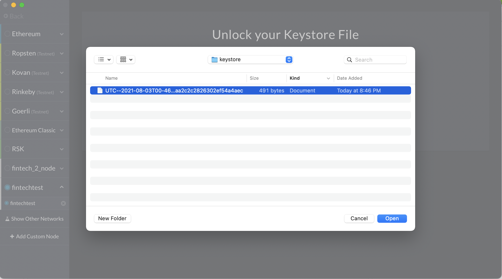

### Sending Transactions

1. Transaction is sent by entering:
  * *To Address* = node2 public key: <code>0xBA7599054Cd43355300F913c00Df9d200c5EEc39</code>
  * *Amount* = integer
  * Press <code>Send Transaction</code>

 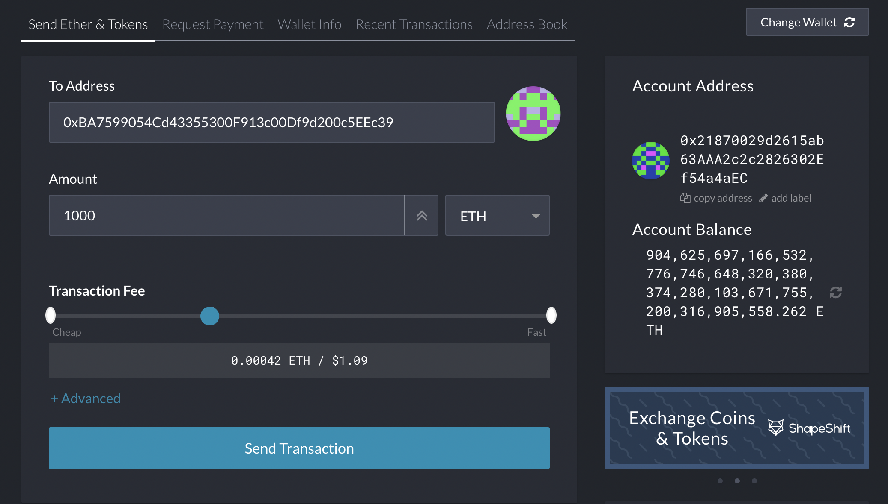


2. Once transaction is sent, a confirmation message will print:

 

3. Nodes process transactions
  * node1 receives transaction and hashes it:
  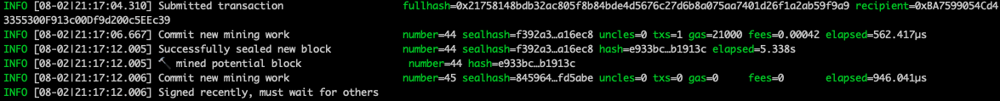

  * node2 confirms the transaction:
  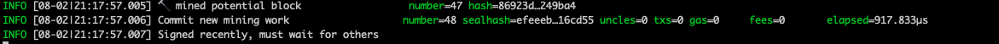


4. Transaction status
  * The status of transaction can be viewed by clicking *TX Status* and entering TX Hash:
  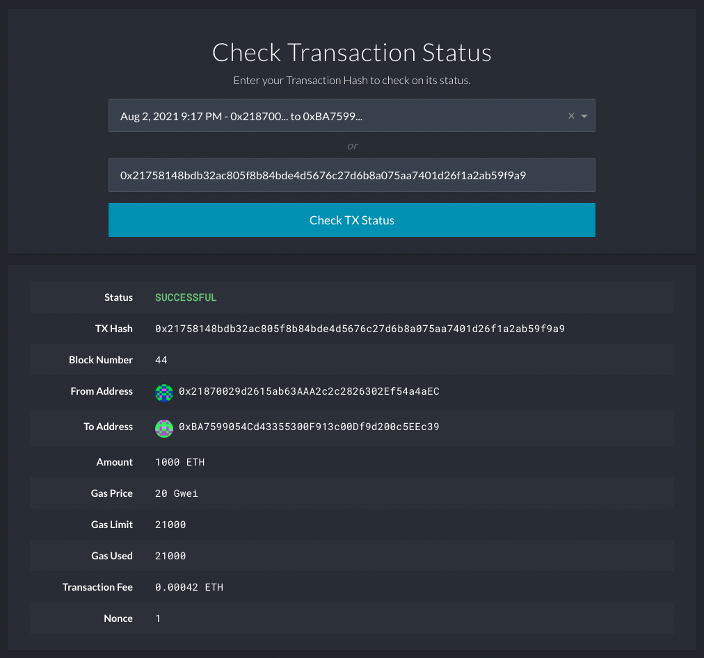

  Here we see that the transaction status is **SUCCESSFUL**.
