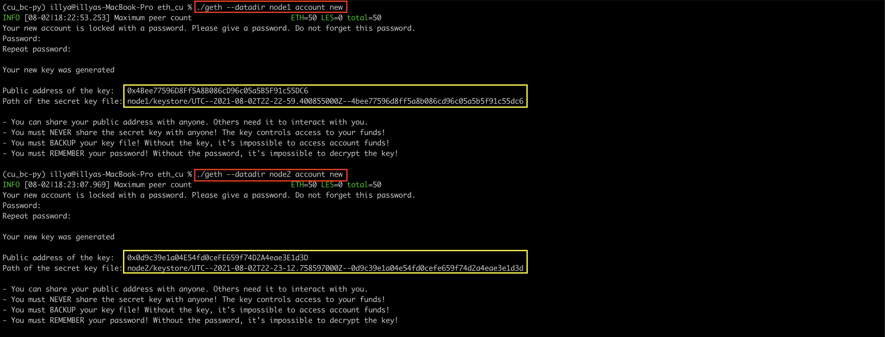
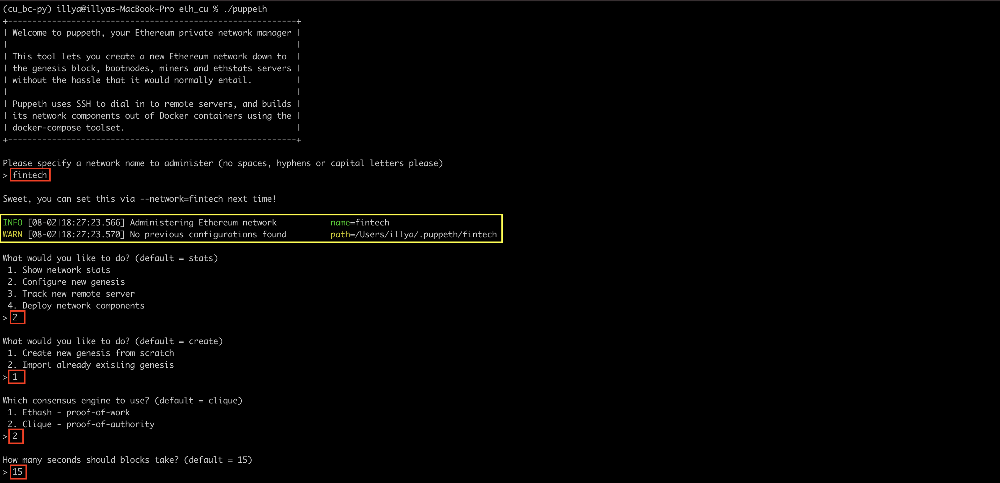
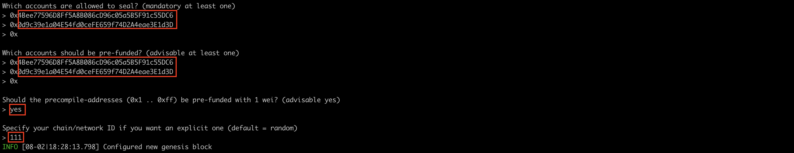
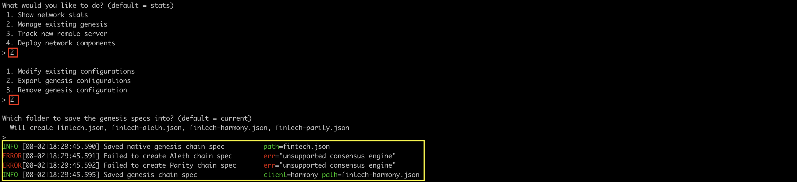
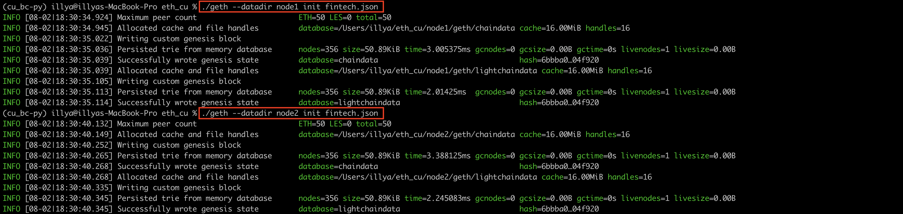
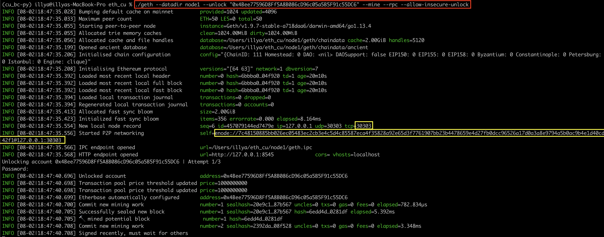
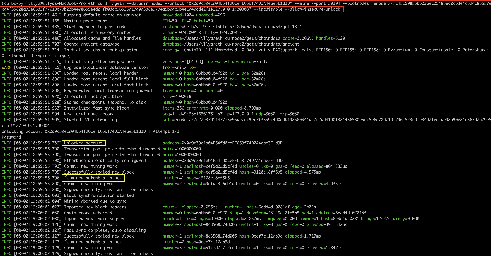

<!-- header is made with: https://github.com/kyechan99/capsule-render -->

[Illya Nayshevsky, Ph.D.](http://www.illya.bio) [](https://www.linkedin.com/in/illyanayshevskyy/)

<br>
Columbia FinTech Bootcamp Assignment

---

### Table of Contents
* [Overview](#overview)
* [Requirements](#requirements)
* [Setup](#setup)
*

---

## Overview


## Requirements

1. [Geth](https://geth.ethereum.org/) - Go Ethereum, the official Go implementaiton of Ethereum protocol.
2. [MyCrypto](https://mycrypto.com/) - MyCrypto is an open-source tool that allows you to manage your Ethereum accounts privately and securely.


## Setup

### 1. Creating accounts for two nodes

Setting up two node blockchain - <code>cd</code> into the directory containing <code>geth</code>

```bash
./geth --datadir node1 account new
./geth --datadir node2 account new
```

When prompted enter the password for each node respectively.
Copy the public key and the path to the secret key file (<mark>outlined in yellow</mark>).




### 2. Generating genesis block

The genesis block is generated with <code>puppeth</code>

```bash
./puppeth
```

a. Enter a network name to administer (no spaces, hyphens or capital letters please)

```bash
> fintech
```

b. What would you like to do? (default = stats). Select option <code>2. Configure new genesis</code>


c. What would you like to do? (default = create). Select option <code>1. Create new genesis from scratch</code>

d. Which consensus engine to use? (default = clique). Select option <code>2. Clique - proof-of-authority</code>

e. How many seconds should blocks take? (default = 15). Enter <code>15</code> seconds.

```bash
> 15
```

f. Which accounts are allowed to seal? (mandatory at least one). Enter accounts generated in step 1. Press <code>Enter</code> after entering 2 public addresses.

```bash
> 0x4Bee77596D8Ff5A8B086cD96c05a5B5F91c55DC6
> 0x0d9c39e1a04E54fd0ceFE659f74D2A4eae3E1d3D
> 0x
```

g. Which accounts should be pre-funded? (advisable at least one) Enter accounts generated in step 1. Press <code>Enter</code> after entering 2 public addresses.

```bash
> 0x4Bee77596D8Ff5A8B086cD96c05a5B5F91c55DC6
> 0x0d9c39e1a04E54fd0ceFE659f74D2A4eae3E1d3D
> 0x
```
h. Should the precompile-addresses (0x1 .. 0xff) be pre-funded with 1 wei? (advisable yes). Enter <code>yes</code>

```bash
> yes
```

i. Specify your chain/network ID if you want an explicit one (default = random). Enter a 3 digit number.

```bash
> 111
```





j. What would you like to do? (default = stats).
    * Select option <code>2. Manage existing genesis</code>
    * Select option <code>2. Export genesis configurations</code>
    * Press <code>Enter</code> - this will place the files in the default directory where <code>geth</code> and <code>puppeth</code> are located.



Although <code>Aleth</code> and <code>Parity</code> will fail to generate, they are not needed. <mark>Output is outlined in yellow</mark>

You can close out of <code>puppeth</code> by pressing <code>Control + C</code> (on MacOS).

### 3. Initialize the nodes

a. The nodes are initialized with <code>./geth</code>, by passing the *node name* into <code>directory</code> flag and *genesis block JSON file* into <code>init</code> flag.

```bash
./geth --datadir node1 init fintech.json
./geth --datadir node2 init fintech.json
```



b. Run the first node (node1)

* <code>./geth</code> <code>--datadir</code> flag should be set to <code>node1</code>
* set <code>--unlock</code> flag to node1's public key
* enable mining by setting the <code>--mining</code> flag
* set [RPC](https://www.jsonrpc.org/specification) (remote procedure call) flag
* setting <code>--allow-insecure-unlock</code> flag.

```bash
./geth --datadir node1 --unlock "0x4Bee77596D8Ff5A8B086cD96c05a5B5F91c55DC6" --mine --rpc --allow-insecure-unlock
```

Once the node is launched, scroll up to <code>Started P2P networking</code> and copy the address and port number, as shown in screenshot below, <mark>highlighted in yellow</mark>:



The output should state that the node is *Unlocked*

c. Run the second node (node2)

Running the second node will require opening a second instance of terminal application

* <code>./geth</code> <code>--datadir</code> flag should be set to <code>node2</code>
* set the <code>--unlock</code> flag to the node2's public key
* set <code>--mine</code> flag
* set <code>--port</code> flag to <code>30304</code>
* pass the *enode* address into <code>--bootnodes</code> flag as a string
* (if running on Windows) set <code>--ipcdisable</code>
* set <code>--allow-insecure-unlock</code> flags

```bash
./geth --datadir node2 --unlock "0x0d9c39e1a04E54fd0ceFE659f74D2A4eae3E1d3D" --mine --port 30304 --bootnodes "enode://7c48150885bb026ec05483ec2cb3e4c5d4c85587eca4f35828a92e65d3f7761907bb23b4478659e4d27fb0dcc96526a17d0a3a8e9794a5b0ac9b4e1d40cd42f1@127.0.0.1:30303" --ipcdisable --allow-insecure-unlock
```

The output should state that the node is *Unlocked* and block are being mined.



### 4. MyCrypto Set-up
