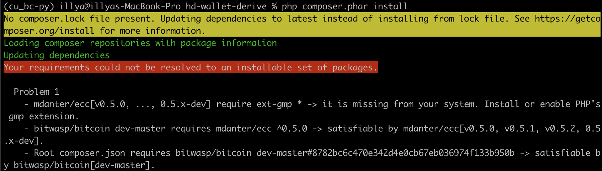
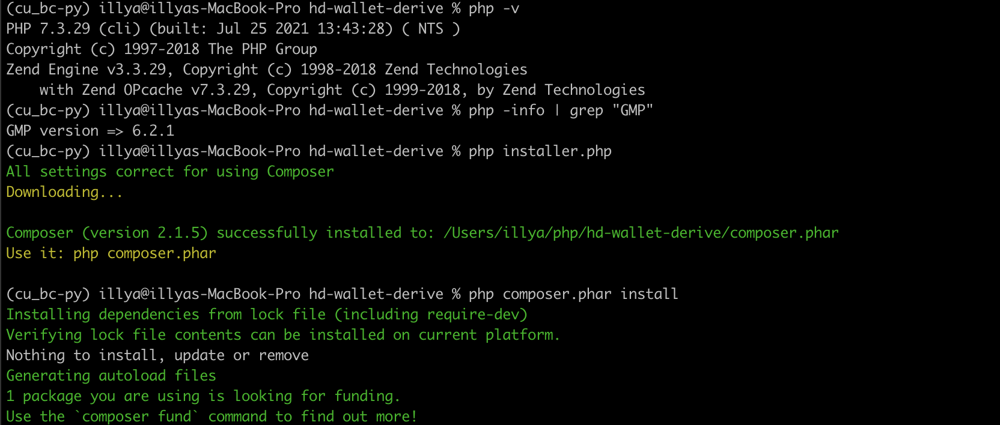

<!-- header is made with: https://github.com/kyechan99/capsule-render -->

[Illya Nayshevsky, Ph.D.](http://www.illya.bio) [](https://www.linkedin.com/in/illyanayshevskyy/)

<br>
Columbia FinTech Bootcamp Assignment

---

### Table of Contents
* [Overview](#overview)
* [Requirements](#requirements)
* [Blockchain Setup](#blockchain-setup)
* [Transacting on Blockchain](#transacting-on-blockchain)

---


    
```bash
git clone https://github.com/dan-da/hd-wallet-derive
cd hd-wallet-derive
curl https://getcomposer.org/installer -o installer.php
php installer.php
php composer.phar install
```  




* On M1 Mac:

```bash

brew reinstall php
export PATH="/usr/local/opt/php@8.0.9/bin:$PATH"
brew services restart php
```

* Now we got GMP, lets downgrade to PHP 7.3

```bash
brew tap shivammathur/php
brew install shivammathur/php/php@7.3
export PATH="/usr/local/opt/php@7.3/bin:$PATH"

brew unlink php
brew link php@7.3
```

```bash
php -v
php -info | grep "GMP"
php installer.php
php composer.phar install
```


* Creating symlink

```bash
ln -s hd-wallet-derive/hd-wallet-derive.php derive
```

