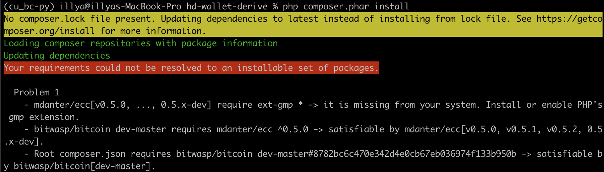
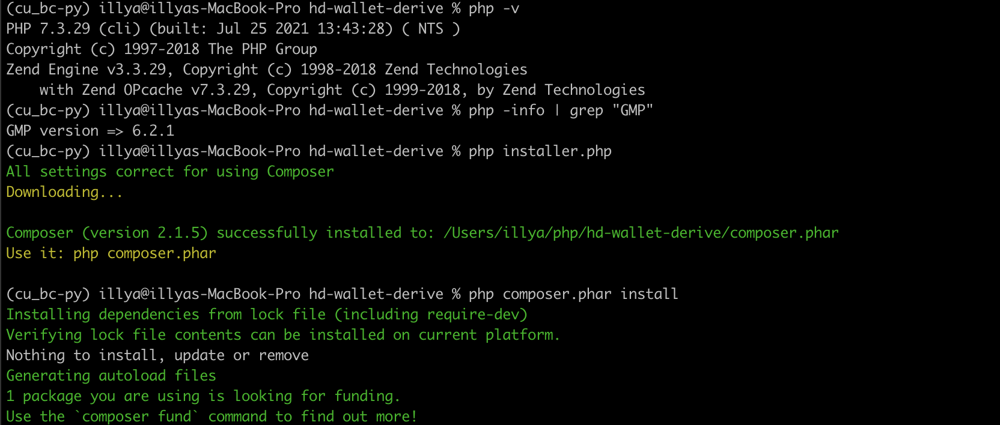
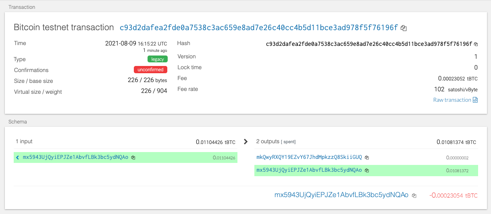
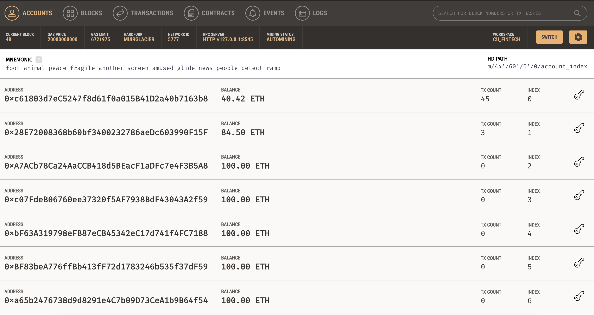
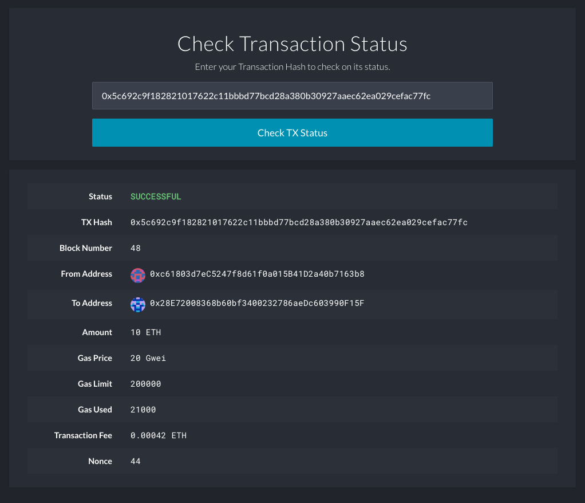

<!-- header is made with: https://github.com/kyechan99/capsule-render -->

[Illya Nayshevsky, Ph.D.](http://www.illya.bio) [](https://www.linkedin.com/in/illyanayshevskyy/)

<br>
Columbia FinTech Bootcamp Assignment

---

### Table of Contents
* [Overview](#overview)
* [Requirements](#requirements)
* [Installation](#requirements)
* [Derive HD Wallet](#derive-hd-wallet)
* [Transacting on Blockchain](#transacting-on-blockchain)

---

## Overview

A multicurrency wallet deployed with [<code>hd-wallet-derive</code>](https://github.com/dan-da/hd-wallet-derive) and controlled via a Python program. The currencies include Test Bitcoin (tBTC) and Ethereum (ETH) running on a private test network. The connectivity to the test networks is provided by the [bit](https://ofek.dev/bit/) and [web3.py](https://web3py.readthedocs.io/en/stable/) libraries respectively. *This program was set up on Apple M1 Silicon computer, instructions provided below*

## Requirements

1. [PHP](https://www.php.net/) - general-purpose scripting language that is especially suited to web development
    * Apple M1 Silicon installation provided below.

2. [<code>hd-wallet-derive</code>](https://github.com/dan-da/hd-wallet-derive) - command-line tool that derives bip32 addresses and private keys for Bitcoin and many altcoins.

3. [bit](https://ofek.github.io/bit/) - Python Bitcoin library

4. [web3.py](https://github.com/ethereum/web3.py) - Python library for interacting with Ethereum

All requirements necessary for running the program are located in the [<code>requirements.txt</code>](resources/requirements.txt) file.

## Installation

### HD-Wallet-Derive Installation
    
```bash
git clone https://github.com/dan-da/hd-wallet-derive
cd hd-wallet-derive
curl https://getcomposer.org/installer -o installer.php
php installer.php
php composer.phar install
```  

#### Apple M1 Silicon troubleshooting

An PHP install error is prevalent on Apple Silicon machines:




* To resolve the error, continue with following commands:

```bash

brew reinstall php
export PATH="/usr/local/opt/php@8.0.9/bin:$PATH"
brew services restart php
```

* Now we got GMP, lets downgrade to PHP 7.3

```bash
brew tap shivammathur/php
brew install shivammathur/php/php@7.3
export PATH="/usr/local/opt/php@7.3/bin:$PATH"

brew unlink php
brew link php@7.3
```

```bash
php -v
php -info | grep "GMP"
php installer.php
php composer.phar install
```


* Creating symlink

```bash
ln -s hd-wallet-derive/hd-wallet-derive.php derive
```

* <code>cd</code> into main directory and generate 12 word mnemonic

```bash
./derive -g --gen-words=12
```

### Installing <code>bit</code> and <code>web3.py</code>


```bash
pip install web3
pip install bit
```

#### Apple M1 Silicon troubleshooting

Apple Silicon machines use fundamentally different [<code>PEP 517</code>](https://www.python.org/dev/peps/pep-0517/) compilers, requiring a dependency of <code>bit</code>, [<code>coincurve</code>](https://pypi.org/project/coincurve/) to be compiled from source locally, instead of installing a pre-compiled image:

```bash
pip uninstall cffi
LDFLAGS=-L$(brew --prefix libffi)/lib CFLAGS=-I$(brew --prefix libffi)/include pip install cffi --no-binary :all:
pip install bit
```

## Derive HD Wallet

[HD Wallets](https://medium.com/cosmostation/the-magic-behind-a-mnemonic-phrase-and-hd-wallets-let-us-explain-43d9c97f6098) enable derivation of deterministic addresses from mnemonic phrases. [<code>hd-wallet-derive</code>](https://github.com/dan-da/hd-wallet-derive) is a python library that supports [BIP32](http://bip32.org/), [BIP39](https://www.blockplate.com/blogs/blockplate/list-of-bip39-wallets-mnemonic-seed), [BIP44](https://github.com/bitcoin/bips/blob/master/bip-0032.mediawiki), and many more other wallet derivation algorithms.

In this example, a wallet is derived from a mnemonic stored in the [<code>mnemonic</code>](resources/mnemonic.env)

The cryptocurrency tags are hard-coded in the [<code>constants.py</code>](constants.py) file.


A wallet is derived via <code>wallet.py</code> app.

1. Launch python shell

```bash
python
```

2. Open <code>wallet.py</code> and run <code>populate_coins_dict()</code>)

```python
from wallet import *
populate_coins_dict()
```

To test the output of the function, one can call the <code>coins</code> dictionary with *coin type* and *index*:

* BTC-TEST:

```python
print("1st address in BTC-TEST blockchain derived from mnemonic :")
from pprint import pprint as pprint
pprint(coins[BTCTEST][0])
```

    Output:

```output
1st address in BTC-TEST blockchain derived from mnemonic :
{'address': 'mx5943UjQyiEPJZe1AbvfLBk3bc5ydNQAo',
 'index': 0,
 'path': "m/44'/1'/0'/0/0",
 'privkey': 'cPNgiXNwcapfe93SUK5YFn8YRAe8C5LESGT4Grwwhk3r3usMCgie',
 'pubkey': '02647bb6672062db5370dc2281751e15cb0992a3d4aaef85fc8f726eea27ca5b08',
 'pubkeyhash': 'b5984dd3ad20d0a2f1097f0dc19806ac2dddddcb',
 'xprv': 'tprv8koAkJFiHT4jHiAsF8AgWXZi9kNNWuUcApBjyeiBAtSYQHmKvewYAUvfJzhYkLkG4P8W15G1QVw7fqKUjv1dC6dRxCgK5cKAs7GmRmUGwKQ',
 'xpub': 'tpubDHVCtiHxRpkQBBCf8mqGuwDpimtJgEfWk7nXGAkUbAEwEn26Z3m8LyYXV8191Gsez6audjhg5dhP7NyXfgFTyBVmKfCPTuVPHatpMdttmxd'}
 ```
 
* ETH

```python
print("1st address in ETH blockchain derived from mnemonic :")
from pprint import pprint as pprint
pprint(coins[ETH][0])
```

    Output:

```output
1st address in ETH blockchain derived from mnemonic :
{'address': '0xc61803d7eC5247f8d61f0a015B41D2a40b7163b8',
 'index': 0,
 'path': "m/44'/60'/0'/0/0",
 'privkey': '0x83d3e09966d875b7c6f2c78dc896973fdf725ea098e91f5b25961c4f00d97de7',
 'pubkey': '0262718bf3764bf7f7fb359f97aa6214b9f5888f78e567574350097681b59c4c75',
 'pubkeyhash': 'ce0ff31ea47bf38d5869307f86c143e2e1e750b0',
 'xprv': 'xprvA2m1CSP2VoQHnmNaQdEcabhhKJ2pv8vG7AY2YoKfn6p8SJqtx785gXjvCiQG192S5xxWVrTirjsmNtkw6QRRE1tu2aqrSCwKnDeRTJAKC5u',
 'xpub': 'xpub6FkMbwuvLAxb1FT3WemcwjeRsKsKKbe7UPTdMBjHLSM7K7B3VeSLEL4Q3yBKh9tmQ7zBbfnbPvCG18EptF6xumoXYDv1cKNnzjRPQkvigEE'}
 ```
 
## Transacting on Blockchain

Transacting on the Bitcoin Testnet is completely handled by the <code>bit</code> library, while transacting on the Etherum private test-net requires initializing <code>web3.py</code> library and connecting to a local testnet node.

In the *python* shell:

```python
# Connect to Etherum Node
url = "http://127.0.0.1:8545"
w3 = Web3(HTTPProvider(url))

# Inject middleware
from web3.middleware import geth_poa_middleware
w3.middleware_onion.inject(geth_poa_middleware, layer=0)

# Check connection
print(f"Connected to Ethereum node {url}: {w3.isConnected()}")
print(f"ChainId : {w3.eth.chainId}")
```

The local Ethereum testnet had the following parameters:
```output
Connected to Ethereum node http://127.0.0.1:8545: True
ChainId : 1337
```

### Creating Bitcoint Test-Net transaction

Transacting on the Bitcoin Testnet and Ethereum blockchains is handled by <code>create_tx()</code> and <code>sent_tx()</code> methods.  

* <code>create_tx()</code> - creates a transaction

    The transaction is built from input parameters:

    ```python
    account, # bit or web3.py account data type
    coin : str, # name of the cryptocurrency/blockchain
    to : str, # destination address
    amount : float or int, # amount to be sent
    gas : int = 1 # FOR Ethereum ONLY: gas
    ```


    For both Bitcoin Testnet and Ethereum, the transaction is signed by respective libraries <code>sign_transaction()</code> method:

```python
signed = account.sign_transaction(raw_tx)
```


* <code>send_tx()</code> - signs and transmits the transaction

    * Transmitting transaction
        * Bitcoin Testnet
        ```python
         NetworkAPI.broadcast_tx_testnet(signed)
        ```
        <br>
    
        * Ethereum
        ```python
        w3.eth.sendRawTransaction(signed.rawTransaction)
        ```
        
    <code>send_tx()</code> takes the following parameters and passes them to <code>create_tx()</code>:
    
    ```python
    account, # bit or web3.py account data type address
    coin : str, # name of the cryptocurrency/blockchain
    to : str, # destination address ETH or BTC-TEST
    amount : float or int, # amount to be sent Ethereum or Bitcoin
    gas : int = 1 # FOR Ethereum ONLY: gas
    ```
    
    The <code>amount</code> is passed in the units of Bitcoin and Ethereum. <code>create_tx()</code> will convert the values into *Satoshi* and *Wei* respectively, which are the units accepted by the respective blockchains.
    
        
        
### Examples of processed transactions

* Bitcoin Testnet

Sending a test transaction from the first Bitcoint Testnet address derived from mnemonic (*index* = 0) to the second address (*index* = 1):

```python
# Test Bitcoin transaction
btc_acc = priv_key_to_account(BTCTEST, coins[BTCTEST][0]['privkey'])
btc_transaction = send_tx(account = btc_acc, 
                          coin=BTCTEST,
                          to="mkQwyRXQY19EZvY67JhdMpkzzQ8SkiiGUQ",
                          amount=0.00000000001)
```


Result:


     
    
    
* Ethereum priveta testnet

Sending a test transaction from the first Ethereum address derived from mnemonic (*index* = 0) to the second address (*index* = 1). A local network was deployed using [Ganache](https://www.trufflesuite.com/ganache) using the same mnemonic derived using <code>hd-wallet-derive</code>:

Ganache local Ethereum testnet:




Ethereum transaction:

```python
# Test Ethereum transaction
eth_acc = priv_key_to_account(ETH, coins[ETH][0]['privkey'])
eth_transaction = send_tx(account = eth_acc, 
                          coin=ETH,
                          to="0x28E72008368b60bf3400232786aeDc603990F15F",
                          amount=10)
```

Result:


