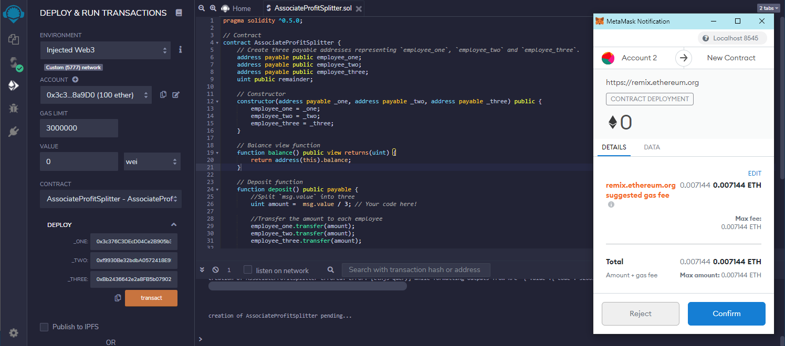
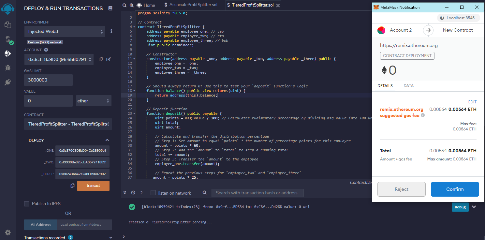
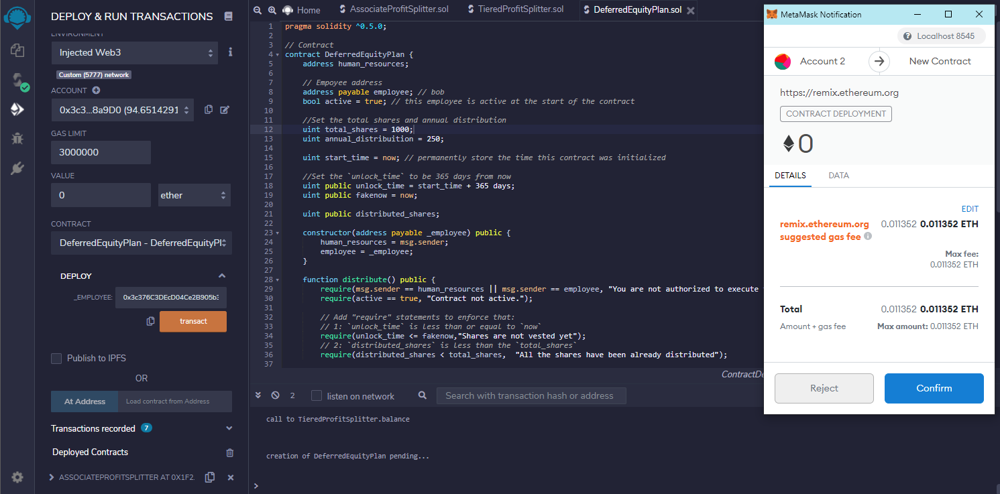

<!-- header is made with: https://github.com/kyechan99/capsule-render -->

[Illya Nayshevsky, Ph.D.](http://www.illya.bio) [](https://www.linkedin.com/in/illyanayshevskyy/)

<br>
Columbia FinTech Bootcamp Assignment

---

### Table of Contents
* [Overview](#overview)
* [Requirements](#requirements)
* [1 - AssociateProfitSplitter Contract](#1---associateprofitsplitter-contract)
* [2 - TieredProfitSplitter Contract](#2---tieredprofitsplitter-contract)
* [3 - DeferredEquityPlan Contract](#3---deferredequityplan-contract)
* [Transacting on Blockchain](#transacting-on-blockchain)

---

## Overview

In this Solidity demonstration a smart contract is written to perform corporate finance tasks on the Ethereum blockchain. The tasks include:

1. Pay your Associate-level employees quickly and easily
2. Distribute profits to different tiers of employees
3. Distribute company shares for employees in a "deferred equity incentive plan" automatically

This provides transparency and automates financial auditing. 

There are 3 levels of contracts:


The contract is written in [Solidity](https://docs.soliditylang.org/en/v0.8.7/) and is deployed on a local testnet managed by [Ganache](https://www.trufflesuite.com/ganache).

---

## Requirements

* [Remix](https://remix.ethereum.org/) - [Solidity](https://docs.soliditylang.org/en/v0.8.7/) development environment 
* [Ganache](https://www.trufflesuite.com/ganache) - Quickly fire up a personal Ethereum blockchain which you can use to run tests, execute commands, and inspect state while controlling how the chain operates

---

## 1 - AssociateProfitSplitter Contract

### Overview

The <code>[AssociateProfitSplitter](AssociateProfitSplitter.sol)</code> Contract accepts Ether into the contract and divides the Ether evenly among the associate level employees. This allows the Human Resources department to pay employees quickly and efficiently.

The contract was also deployed on the Ropsten testnet <code>[0x6d67dDeA749717eB2536C378F160B6Ec8d42f5EC](https://ropsten.etherscan.io/address/0x6d67dDeA749717eB2536C378F160B6Ec8d42f5EC)</code>

### Deployment

Deploying the contract on local testnet:



Initial Ganache account values:


### Interacting

Depositing ETH into the contract:


Final Ganache account values:


---

## 2 - TieredProfitSplitter Contract

<code>[TieredProfitSplitter](TieredProfitSplitter.sol)</code> rather than splitting the profits between Associate-level employees, calculates rudimentary percentages for different tiers of employees (CEO, CTO, and Bob).

The contract was also deployed on the Ropsten testnet <code>[0xf0c0880e58b2569654Bf0561B148648f4AEBB773](https://ropsten.etherscan.io/address/0xf0c0880e58b2569654Bf0561B148648f4AEBB773)</code>

### Deployment

Deploying the contract on local testnet:



Initial Ganache account values:


### Interacting

Depositing ETH into the contract:


Final Ganache account values:


---

## 3 - DeferredEquityPlan Contract

<code>[DeferredEquityPlan](DeferredEquityPlan.sol)</code> contract will automatically manage 1000 shares with an annual distribution of 250 over 4 years for a single employee.

The contract was also deployed on the Ropsten testnet <code>[0xf76aA28cf22C41925aE717aE456A71C4ec08D084](https://ropsten.etherscan.io/address/0xf76aA28cf22C41925aE717aE456A71C4ec08D084)</code>
  
### Deployment

Deploying the contract on local testnet:



### Interacting

This contract has time restraints on distributions. Since the unlock date is greater than the current date the "distribution" will not be possible. An error message <code>Shares are not vested yet</code> is displayed:


For demonstration purposes the date stored in the contract can be manually "fast-forwarded". To implement this solution a <code>fakenow</code> variable is used to store the data and can be edited via <code>fastforward()</code> function.

```C#
//Set the `unlock_time` to be 365 days from now
    uint public unlock_time = start_time + 365 days;
    uint public fakenow = now;

function fastforward() public {
    fakenow += 100 days;
```


Afterward fastforwarding 400 days <code>distribute()</code> function can demonstrate distribution:


Calling the <code>distributed_shares</code> variable reveals that 1000 shares have been distributed.


